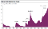
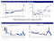
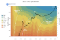

<!DOCTYPE html>
<html xmlns:cc="http://creativecommons.org/ns#"><head prefix="og: http://ogp.me/ns# fb: http://ogp.me/ns/fb# medium-com: http://ogp.me/ns/fb/medium-com#"><meta http-equiv="Content-Type" content="text/html; charset=UTF-8"><meta name="viewport" content="width=device-width, initial-scale=1.0, viewport-fit=contain"><title>Hodlers are the revolutionaries – Token Economy</title><link rel="canonical" href="https://tokeneconomy.co/hodlers-are-the-revolutionaries-66c8362ef9eb"><meta name="title" content="Hodlers are the revolutionaries – Token Economy"><meta name="referrer" content="always"><meta name="description" content="My reflections on the important role hodlers play in developing Bitcoin’s network (and other cryptocurrency networks). Satoshi published the Bitcoin white paper on 10/31/2008, one month after the…"><meta name="theme-color" content="#000000"><meta property="og:title" content="Hodlers are the revolutionaries – Token Economy"><meta property="twitter:title" content="Hodlers are the revolutionaries"><meta property="og:url" content="https://tokeneconomy.co/hodlers-are-the-revolutionaries-66c8362ef9eb"><meta property="og:image" content="https://cdn-images-1.medium.com/max/1200/1*2L7p7uy31btd5gDodKC8wg.jpeg"><meta property="fb:app_id" content="542599432471018"><meta property="og:description" content="My reflections on the important role hodlers play in developing Bitcoin’s network (and other cryptocurrency networks)."><meta name="twitter:description" content="My reflections on the important role hodlers play in developing Bitcoin’s network (and other cryptocurrency networks)."><meta name="twitter:image:src" content="https://cdn-images-1.medium.com/max/1200/1*2L7p7uy31btd5gDodKC8wg.jpeg"><link rel="author" href="https://tokeneconomy.co/@danhedl"><meta name="author" content="Dan Held"><meta property="og:type" content="article"><meta name="twitter:card" content="summary_large_image"><meta property="article:publisher" content="https://www.facebook.com/medium"><meta property="article:author" content="10108549165321044"><meta name="robots" content="index, follow"><meta property="article:published_time" content="2018-08-31T16:30:54.210Z"><meta name="twitter:creator" content="@danheld"><meta name="twitter:site" content="@Medium"><meta property="og:site_name" content="Token Economy"><meta name="twitter:label1" value="Reading time"><meta name="twitter:data1" value="7 min read"><meta name="twitter:app:name:iphone" content="Medium"><meta name="twitter:app:id:iphone" content="828256236"><meta name="twitter:app:url:iphone" content="medium://p/66c8362ef9eb"><meta property="al:ios:app_name" content="Medium"><meta property="al:ios:app_store_id" content="828256236"><meta property="al:android:package" content="com.medium.reader"><meta property="al:android:app_name" content="Medium"><meta property="al:ios:url" content="medium://p/66c8362ef9eb"><meta property="al:android:url" content="medium://p/66c8362ef9eb"><meta property="al:web:url" content="https://tokeneconomy.co/hodlers-are-the-revolutionaries-66c8362ef9eb"><link rel="search" type="application/opensearchdescription+xml" title="Medium" href="https://tokeneconomy.co/osd.xml"><link rel="alternate" href="android-app://com.medium.reader/https/medium.com/p/66c8362ef9eb"><meta name="parsely-link" content="https://tokeneconomy.co/hodlers-are-the-revolutionaries-66c8362ef9eb"><link rel="stylesheet" type="text/css" class="js-glyph-" id="glyph-8" href="2018-08-31-hodlers-are-the-revolutionaries_files/m2.css"><link rel="stylesheet" href="2018-08-31-hodlers-are-the-revolutionaries_files/main-branding-base.css"><!--[if lt IE 9]><![endif]--><link rel="icon" href="https://cdn-images-1.medium.com/fit/c/160/160/1*us-HPqfF2yhm-TTod3qu3Q.png" class="js-favicon"><link rel="apple-touch-icon" sizes="152x152" href="https://cdn-images-1.medium.com/fit/c/304/304/1*ayHkb8Us8_8EBY-BphIQTw.png"><link rel="apple-touch-icon" sizes="120x120" href="https://cdn-images-1.medium.com/fit/c/240/240/1*ayHkb8Us8_8EBY-BphIQTw.png"><link rel="apple-touch-icon" sizes="76x76" href="https://cdn-images-1.medium.com/fit/c/152/152/1*ayHkb8Us8_8EBY-BphIQTw.png"><link rel="apple-touch-icon" sizes="60x60" href="2018-08-31-hodlers-are-the-revolutionaries_files/1ayHkb8Us8_8EBY-BphIQTw.png"><link rel="mask-icon" href="https://cdn-static-1.medium.com/_/fp/icons/monogram-mask.KPLCSFEZviQN0jQ7veN2RQ.svg" color="#171717"><link rel="stylesheet" type="text/css" href="2018-08-31-hodlers-are-the-revolutionaries_files/MyFontsWebfontsKit.css"><meta name="lollix"></head><body itemscope="" class="postShowScreen browser-firefox os-windows is-withMagicUnderlines v-glyph v-glyph--m2 is-js" data-action-scope="_actionscope_0" cz-shortcut-listen="true">

<canvas class="canvas-renderer" width="1065" height="1753"></canvas>

<button class="button button--chromeless" data-action="select-anchor" data-action-value="80a5">Top highlight</button>

<button class="button button--chromeless" data-action="select-anchor" data-action-value="5a4e">Brandon Quittem</button>

<a href="https://medium.com/" data-log-event="home" class="siteNav-logo u-fillTransparentBlackDarker u-flex0 u-flexCenter u-paddingTop0"><svg class="svgIcon-use" xlink="http://www.w3.org/1999/xlink" height="45" width="45"><path id="monogram" d="M5 40V5h35v35H5zm8.56-12.627c0 .555-.027.687-.318 1.03l-2.457 2.985v.396h6.974v-.396l-2.456-2.985c-.291-.343-.344-.502-.344-1.03V18.42l6.127 13.364h.714l5.256-13.364v10.644c0 .29 0 .342-.185.528l-1.848 1.796v.396h9.19v-.396l-1.822-1.796c-.184-.186-.21-.238-.21-.528V15.937c0-.291.026-.344.21-.528l1.823-1.797v-.396h-6.471l-4.622 11.542-5.203-11.542h-6.79v.396l2.14 2.64c.239.292.291.37.291.768v10.353z"></path><g clip-path="url(#rainbow)"><path fill="#E40303" d="M0 0h45v10.8H0z"></path><path fill="#FF8B00" d="M0 10.8h45v5.8H0z"></path><path fill="#FEED02" d="M0 16.6h45v6H0z"></path><path fill="#008025" d="M0 22.6h45v5.8H0z"></path><path fill="#014CFE" d="M0 28.4h45v5.8H0z"></path><path fill="#750887" d="M0 34.2h45V45H0z"></path></g><clipPath id="rainbow"><use xlink:href="#monogram"></use></clipPath></svg>Homepage</a>

<label class="button button--small button--chromeless button--withIcon button--withSvgIcon inputGroup u-sm-hide metabar-predictiveSearch u-baseColor--buttonNormal u-baseColor--placeholderNormal" title="Search"><svg class="svgIcon-use" width="25" height="25"><path d="M20.067 18.933l-4.157-4.157a6 6 0 1 0-.884.884l4.157 4.157a.624.624 0 1 0 .884-.884zM6.5 11c0-2.62 2.13-4.75 4.75-4.75S16 8.38 16 11s-2.13 4.75-4.75 4.75S6.5 13.62 6.5 11z"></path></svg><input class="js-predictiveSearchInput textInput textInput--rounded textInput--darkText u-baseColor--textNormal textInput--transparent" type="search" placeholder="Search" required="true" data-collection-id="fbbd350c08fc"></label><a class="button button--small button--chromeless u-sm-show is-inSiteNavBar u-baseColor--buttonNormal button--withIcon button--withSvgIcon button--chromeless u-xs-top1" href="https://tokeneconomy.co/search" title="Search" aria-label="Search"><svg class="svgIcon-use" width="25" height="25"><path d="M20.067 18.933l-4.157-4.157a6 6 0 1 0-.884.884l4.157 4.157a.624.624 0 1 0 .884-.884zM6.5 11c0-2.62 2.13-4.75 4.75-4.75S16 8.38 16 11s-2.13 4.75-4.75 4.75S6.5 13.62 6.5 11z"></path></svg></a><a class="button button--small button--chromeless is-inSiteNavBar u-baseColor--buttonNormal button--withIcon button--withSvgIcon button--chromeless u-xs-hide" href="https://medium.com/me/list/queue" title="Bookmarks" aria-label="Bookmarks"><svg class="svgIcon-use" width="25" height="25"><path d="M16 6c1.1 0 2 .9 2 2v13.661h-.012a.5.5 0 0 1-.118.285.508.508 0 0 1-.708.03L11.5 17.85l-5.662 4.125a.5.5 0 0 1-.706-.03.478.478 0 0 1-.12-.285H5V8c0-1.1.9-2 2-2h9zM6 8v12.636l5.162-3.667a.49.49 0 0 1 .676 0L17 20.637V8c0-.55-.45-1-1-1H7c-.55 0-1 .45-1 1z"></path><path d="M21 5v13.661h-.012a.5.5 0 0 1-.118.285.508.508 0 0 1-.708.03L20 18.858V5c0-.55-.45-1-1-1h-9c-.55 0-1 .45-1 1H8c0-1.1.9-2 2-2h9c1.1 0 2 .9 2 2z"></path></svg></a><button class="button button--small button--chromeless is-inSiteNavBar u-baseColor--buttonNormal button--withIcon button--withSvgIcon button--activity js-notificationsButton u-marginRight16 u-xs-marginRight10 u-lineHeight0 u-size25x25" title="Notifications" aria-label="Notifications" data-action="open-notifications"><svg class="svgIcon-use" width="25" height="25" viewBox="-293 409 25 25"><path d="M-273.327 423.67l-1.673-1.52v-3.646a5.5 5.5 0 0 0-6.04-5.474c-2.86.273-4.96 2.838-4.96 5.71v3.41l-1.68 1.553c-.204.19-.32.456-.32.734V427a1 1 0 0 0 1 1h3.49a3.079 3.079 0 0 0 3.01 2.45 3.08 3.08 0 0 0 3.01-2.45h3.49a1 1 0 0 0 1-1v-2.59c0-.28-.12-.55-.327-.74zm-7.173 5.63c-.842 0-1.55-.546-1.812-1.3h3.624a1.92 1.92 0 0 1-1.812 1.3zm6.35-2.45h-12.7v-2.347l1.63-1.51c.236-.216.37-.522.37-.843v-3.41c0-2.35 1.72-4.356 3.92-4.565a4.353 4.353 0 0 1 4.78 4.33v3.645c0 .324.137.633.376.85l1.624 1.477v2.373z"></path></svg></button><button class="button button--chromeless u-baseColor--buttonNormal is-inSiteNavBar js-userActions" aria-haspopup="true" data-action="open-userActions">

<svg viewBox="0 0 40 40" xmlns="http://www.w3.org/2000/svg"><path d="M3.44615311,11.6601601 C6.57294867,5.47967718 12.9131553,1.5 19.9642857,1.5 C27.0154162,1.5 33.3556228,5.47967718 36.4824183,11.6601601 L37.3747245,11.2087295 C34.0793076,4.69494641 27.3961457,0.5 19.9642857,0.5 C12.5324257,0.5 5.84926381,4.69494641 2.55384689,11.2087295 L3.44615311,11.6601601 Z"></path><path d="M36.4824183,28.2564276 C33.3556228,34.4369105 27.0154162,38.4165876 19.9642857,38.4165876 C12.9131553,38.4165876 6.57294867,34.4369105 3.44615311,28.2564276 L2.55384689,28.7078582 C5.84926381,35.2216412 12.5324257,39.4165876 19.9642857,39.4165876 C27.3961457,39.4165876 34.0793076,35.2216412 37.3747245,28.7078582 L36.4824183,28.2564276 Z"></path></svg>

</button>

<nav role="navigation" class="metabar-block metabar-block--below u-flexCenter u-overflowHidden u-height54">

<ul class="u-textAlignLeft u-noWrap u-overflowX u-height80 u-marginTop40 js-collectionNavItems"><li class="metabar-navItem js-collectionNavItem u-inlineBlock u-fontSize13 u-textUppercase u-letterSpacing1px u-textColorNormal u-xs-paddingRight12 u-xs-marginRight0 u-xs-paddingTop10"><a class="link link--darken u-accentColor--textDarken link--noUnderline u-baseColor--link js-navItemLink" href="https://tokeneconomy.co/tagged/token-economy-weekly">Newsletter Issues</a></li><li class="metabar-navItem js-collectionNavItem u-inlineBlock u-fontSize13 u-textUppercase u-letterSpacing1px u-textColorNormal u-xs-paddingRight12 u-xs-marginRight0 u-xs-paddingTop10"><a class="link link--darken u-accentColor--textDarken link--noUnderline u-baseColor--link js-navItemLink" href="https://tokeneconomy.co/tagged/token-economy">Thoughts</a></li><li class="metabar-navItem js-collectionNavItem u-inlineBlock u-fontSize13 u-textUppercase u-letterSpacing1px u-textColorNormal u-xs-paddingRight12 u-xs-marginRight0 u-xs-paddingTop10"><a class="link link--darken u-accentColor--textDarken link--noUnderline u-baseColor--link js-navItemLink" href="https://tokeneconomy.co/tagged/token-economy-projects">Projects</a></li><li class="metabar-navItem js-collectionNavItem u-inlineBlock u-fontSize13 u-textUppercase u-letterSpacing1px u-textColorNormal u-xs-paddingRight12 u-xs-marginRight0 u-xs-paddingTop10"><a class="link link--darken u-accentColor--textDarken link--noUnderline u-baseColor--link js-navItemLink" href="https://tokeneconomy.co/tagged/token-economy-events">Events</a></li><li class="metabar-navItem js-collectionNavItem u-inlineBlock u-fontSize13 u-textUppercase u-letterSpacing1px u-textColorNormal u-xs-paddingRight12 u-xs-marginRight0 u-xs-paddingTop10"><a class="link link--darken u-accentColor--textDarken link--noUnderline u-baseColor--link js-navItemLink" href="https://tokeneconomy.co/archive">Archive</a></li><li class="metabar-navItem js-collectionNavItem u-inlineBlock u-fontSize13 u-textUppercase u-letterSpacing1px u-textColorNormal u-xs-paddingRight12 u-xs-marginRight0 u-xs-paddingTop10"><a class="link link--darken u-accentColor--textDarken link--noUnderline u-baseColor--link js-navItemLink" href="https://tokeneconomy.co/about">About</a></li><li class="metabar-navItem js-collectionNavItem is-external u-inlineBlock u-fontSize13 u-textUppercase u-letterSpacing1px u-textColorNormal u-xs-paddingRight12 u-xs-marginRight0 u-xs-paddingTop10"><a class="link link--darkenOnHover u-accentColor--textDarken link--noUnderline u-baseColor--link js-navItemLink" href="https://tokeneconomy442891.typeform.com/to/ac1J2m" rel="nofollow noopener" target="_blank">Launching a new product? 🚀</a></li></ul>

</nav>

<main role="main"><article class=" u-minHeight100vhOffset65 u-overflowHidden postArticle postArticle--full is-withAccentColors" lang="en">
<section name="a461" class="section section--body section--first section--last">

<h1 name="b97f" id="b97f" class="graf graf--h3 graf--leading graf--title">Hodlers are the revolutionaries</h1>

<a class="ds-link ds-link--styleSubtle ui-captionStrong u-inlineBlock link link--darken link--darker" href="https://tokeneconomy.co/@danhedl" data-action="show-user-card" data-action-value="405d30706535" data-action-type="hover" data-user-id="405d30706535" data-collection-slug="token-economy" dir="auto">Dan Held</a>

<time datetime="2018-08-31T16:30:54.210Z">Aug 31, 2018</time>

<figure name="3130" id="3130" class="graf graf--figure graf-after--h3">

<canvas class="progressiveMedia-canvas js-progressiveMedia-canvas" width="75" height="37"></canvas><noscript class="js-progressiveMedia-inner"></noscript>

</figure>
My reflections on the important role hodlers play in developing Bitcoin’s network (and other cryptocurrency networks).
<blockquote name="dc5c" id="dc5c" class="graf graf--blockquote graf--startsWithDoubleQuote graf-after--p"><em class="markup--em markup--blockquote-em">“In
 the beginning of a change the patriot is a scarce man, and brave, and 
hated and scorned. When his cause succeeds, the timid join him, for then
 it costs nothing to be a patriot.”</em> — Mark Twain</blockquote>
Satoshi
 published the Bitcoin white paper on 10/31/2008, one month after the 
collapse of Lehman Brothers sent a shockwave through the financial 
system. Bitcoin was incepted in a time of absolute necessity. Trust had 
been lost in a world that ran on trust.
<figure name="48b5" id="48b5" class="graf graf--figure graf-after--p">

<canvas class="progressiveMedia-canvas js-progressiveMedia-canvas" width="75" height="30"></canvas><noscript class="js-progressiveMedia-inner"></noscript>

</figure><blockquote name="80a5" id="80a5" class="graf graf--blockquote graf--startsWithDoubleQuote graf-after--figure"><em class="markup--em markup--blockquote-em">“The
 root problem with conventional currency is all the trust that’s 
required to make it work. The central bank must be trusted not to debase
 the currency, but the history of fiat currencies is full of breaches of
 that trust. Banks must be trusted to hold our money and transfer it 
electronically, but they lend it out in waves of credit bubbles with 
barely a fraction in reserve.”</em> — Satoshi Nakamoto</blockquote>
Through
 intervention by central banks during the financial crisis, markets have
 become incredibly distorted, with risk/reward the most skewed its ever 
been in recorded history. Over ~9T of bonds trade with <a href="https://www.ft.com/content/86e1e87e-81ed-11e7-a4ce-15b2513cb3ff" data-href="https://www.ft.com/content/86e1e87e-81ed-11e7-a4ce-15b2513cb3ff" class="markup--anchor markup--p-anchor" rel="noopener" target="_blank">negative</a> yield.

What
 is unique about the current period is that never before in observable 
history have so many countries had such long periods without sustainable
 surpluses. For example, the US has now run a deficit for 40 of the last
 44 years (including 2012)
<figure name="85b9" id="85b9" class="graf graf--figure graf-after--p">

<canvas class="progressiveMedia-canvas js-progressiveMedia-canvas" width="75" height="46"></canvas><noscript class="js-progressiveMedia-inner"></noscript>

<figcaption class="imageCaption">How do you think this plays&nbsp;out?</figcaption></figure><blockquote name="4d43" id="4d43" class="graf graf--blockquote graf--startsWithDoubleQuote graf-after--figure">“Prior
 to the 20th century, ordinary people could always flee to hard currency
 (gold) to save themselves from the effects of the <a href="https://mises.org/library/how-central-banking-increased-inequality" data-href="https://mises.org/library/how-central-banking-increased-inequality" class="markup--anchor markup--blockquote-anchor" rel="noopener" target="_blank">failed</a>, inflationist, policies of the central bank. This ended across much of the world in the 20th century as gold was outlawed.” — <a href="https://twitter.com/real_vijay?lang=en" data-href="https://twitter.com/real_vijay?lang=en" class="markup--anchor markup--blockquote-anchor" rel="noopener" target="_blank">Vijay Boyapati</a></blockquote>
Never
 before in observable history have so many countries been off a precious
 metal type currency system for so long. Coming off the gold standard in
 1971 helped create the conditions for almost unlimited credit and debt 
creation potential that would have been inconceivable through the annuls
 of economic history.
<blockquote name="4a52" id="4a52" class="graf graf--blockquote graf--startsWithDoubleQuote graf-after--p">“So
 after 41 years of global fiat currencies and an unparalleled amount of 
debt that is proving very difficult to shift, we really are venturing 
into the unknown.” — Jim Reid</blockquote><figure name="2ef0" id="2ef0" class="graf graf--figure graf-after--blockquote" style="">

<canvas class="progressiveMedia-canvas js-progressiveMedia-canvas" width="75" height="57"></canvas><noscript class="js-progressiveMedia-inner"></noscript>

</figure>
Bitcoin
 was created to build a new financial system, one that didn’t require 
trust, which adhered to principles of sound money. And why does sound 
money matter?

Money
 is the tool we use to signal consumer preference. By having a targeted 
and efficient means to relay consumer demand, producers can concentrate 
efforts towards goods and services the market desires most. Sound money 
facilitates this. With unsound money, the market loses the ability to 
relay its demands to producers. This is why socialism/centrally planned 
economies simply cannot function. The invisible hand mechanism is too 
profound and powerful to artificially replicate. Sound money is the 
catalyst to maximize the division of labour through the maximal 
efficiency of financial communication.
<blockquote name="a9d6" id="a9d6" class="graf graf--blockquote graf--startsWithDoubleQuote graf-after--p"><em class="markup--em markup--blockquote-em">“Over
 and over again, the financial system was, in some narrow way, 
discredited…. the rebellion by American youth against the money culture 
never happened” — Big Short</em></blockquote>
Satoshi
 built Bitcoin for the believers in new financial system, the hodlers, 
the revolutionaries. The ones who were disenfranchised with the existing
 financial system. The ones who are attracted by the prospect of sudden 
and spectacular change in their life.
<blockquote name="7bf5" id="7bf5" class="graf graf--blockquote graf--startsWithDoubleQuote graf-after--p"><em class="markup--em markup--blockquote-em">“In
 this sense, it’s more typical of a precious metal. Instead of the 
supply changing to keep the value the same, the supply is predetermined 
and the value changes. As the number of users grows, the value per coin 
increases. It has the potential for a positive feedback loop; as users 
increase, the value goes up, which could attract more users to take 
advantage of the increasing value.” — </em><a href="http://p2pfoundation.ning.com/forum/topics/bitcoin-open-source?commentId=2003008%3AComment%3A9562" data-href="http://p2pfoundation.ning.com/forum/topics/bitcoin-open-source?commentId=2003008%3AComment%3A9562" class="markup--anchor markup--blockquote-anchor" rel="noopener" target="_blank">Satoshi Nakamoto</a></blockquote>
Satoshi
 needed to bootstrap the network with an incentive mechanism — the block
 reward which (a) controlled currency supply of Bitcoin and (b) created 
an incentive for people to protect the network.
<blockquote name="13a6" id="13a6" class="graf graf--blockquote graf--startsWithDoubleQuote graf-after--p"><em class="markup--em markup--blockquote-em">“Hodling
 bootstrapped bitcoin into existence. Hodling increases value, which 
increases demand, hash rate, and network security, which, in turn, 
attracts new hodlers and devs. This self-reinforcing feedback loop 
drives bitcoin’s network effects, security, and value.” </em>— <a href="https://twitter.com/TobiasAHuber" data-href="https://twitter.com/TobiasAHuber" class="markup--anchor markup--blockquote-anchor" rel="noopener" target="_blank"><em class="markup--em markup--blockquote-em">@TobiasAHuber</em></a></blockquote>
Early
 hodlers believed in Bitcoin despite overwhelming negativity and false 
information (ex: labeled as a currency for money launderers and drug 
dealers, price fluctuations). Hodlers had stronger risk appetite to 
weather the volatility of being a first mover. They’re practitioners of 
skin in the game
<blockquote name="f085" id="f085" class="graf graf--blockquote graf--startsWithDoubleQuote graf-after--p"><em class="markup--em markup--blockquote-em">“Don’t tell me what you think, show me your portfolio.”</em> <a href="https://mobile.twitter.com/nntaleb" data-href="https://mobile.twitter.com/nntaleb" class="markup--anchor markup--blockquote-anchor" rel="noopener" target="_blank">— @nntaleb</a></blockquote><blockquote name="3c62" id="3c62" class="graf graf--blockquote graf--startsWithDoubleQuote graf-after--blockquote"><em class="markup--em markup--blockquote-em">“Holding
 bitcoin is the exact opposite of speculation. A trade can be called 
speculative when the incentives for buying and selling is merely based 
on market sentiment. You hope to sell the product for profit despite the
 fact that it did not accrue any intrinsic value for society over the 
holding period. Holding of money does not have this downside, rather the
 opposite is true. By holding money you invest in the economy as a 
whole. Every time you choose to retain money you decrease the available 
amount in circulation…This leads to the increase of purchasing power per
 unit of that money. The result is that prices fall and all participants
 in that economy become wealthier. By holding Bitcoin the price per unit
 increases. The more people hold Bitcoin in the long run, the more 
volatility drops towards a gradual increase in price. This convergence 
towards a stable increase in price makes Bitcoin more attractive to new 
audiences, creating a feedback loop.”</em> — <a href="https://twitter.com/Willem_VdBergh" data-href="https://twitter.com/Willem_VdBergh" class="markup--anchor markup--blockquote-anchor" rel="noopener" target="_blank">Willem_VdBergh</a></blockquote><blockquote name="ca23" id="ca23" class="graf graf--blockquote graf--startsWithDoubleQuote graf-after--blockquote">“The
 increase in Bitcoin’s price has corresponding virality. And as it 
expands, hodling becomes popular with people with a lower risk appetite,
 pulling in more and more network effect into the Bitcoin black 
hole” — @robustus</blockquote>
With
 each of those boom/bust cycles we’ve seen Bitcoin redistributed from 
old hodlers to new hodlers via selling, decreasing the Gini Coefficient.
 In 2017 <a href="https://blog.unchained-capital.com/bitcoin-data-science-pt-1-hodl-waves-7f3501d53f63" data-href="https://blog.unchained-capital.com/bitcoin-data-science-pt-1-hodl-waves-7f3501d53f63" class="markup--anchor markup--p-anchor" rel="noopener" target="_blank">alone</a>, we saw 15% of all BTC move out of old hodler hands.
<figure name="f1c4" id="f1c4" class="graf graf--figure graf-after--p">

<canvas class="progressiveMedia-canvas js-progressiveMedia-canvas" width="75" height="50"></canvas><noscript class="js-progressiveMedia-inner"></noscript>

</figure><blockquote name="87ef" id="87ef" class="graf graf--blockquote graf--startsWithDoubleQuote graf-after--figure"><em class="markup--em markup--blockquote-em">“Slowly, but surely, Bitcoin creeps further and further into the psyche of those in</em><a href="https://twitter.com/real_vijay/status/1020094385587859456" data-href="https://twitter.com/real_vijay/status/1020094385587859456" class="markup--anchor markup--blockquote-anchor" rel="noopener" target="_blank"><em class="markup--em markup--blockquote-em"> charge</em></a><em class="markup--em markup--blockquote-em">” — </em><a href="https://twitter.com/real_vijay" data-href="https://twitter.com/real_vijay" class="markup--anchor markup--blockquote-anchor" rel="noopener" target="_blank">Vijay Boyapati</a></blockquote>
Via
 the Lindy Effect, the longer Bitcoin remains in existence the greater 
society’s confidence that it will continue to exist long into the 
future.
<blockquote name="9e58" id="9e58" class="graf graf--blockquote graf--startsWithDoubleQuote graf-after--p"><em class="markup--em markup--blockquote-em">“Protocols die when they run out of believers.”</em> <em class="markup--em markup--blockquote-em">— </em><a href="https://twitter.com/naval" data-href="https://twitter.com/naval" class="markup--anchor markup--blockquote-anchor" rel="noopener" target="_blank">Naval</a></blockquote>
The faith in a new financial system is what binds everything together. Bitcoin is not just a software project. It’s a method of coordination for a large group of people who face powerful adversaries. Bitcoin isn’t just a technological breakthrough, it’s also a social one.
<blockquote name="972b" id="972b" class="graf graf--blockquote graf--startsWithDoubleQuote graf-after--p"><em class="markup--em markup--blockquote-em">“A
 stable and sustainable ideology must be the foundation of all 
cryptocurrencies. No amount of cryptography, or consensus protocol 
development will help a cryptocurrency with an unstable and bankrupt 
ideology. Stable ideologies allow communities to thrive”. </em><a href="https://hackernoon.com/@kaykurokawa?source=post_header_lockup" data-href="https://hackernoon.com/@kaykurokawa?source=post_header_lockup" class="markup--anchor markup--blockquote-anchor" rel="noopener" target="_blank"><em class="markup--em markup--blockquote-em">— Kay Kurokawa</em></a></blockquote>
Money
 is a winner-take-all technology, driven by network effects. The crypto 
with the most hodlers, therefore, is the most demanded by consumers and 
will be the ultimate winner.
<blockquote name="12f5" id="12f5" class="graf graf--blockquote graf--startsWithDoubleQuote graf-after--p">“<em class="markup--em markup--blockquote-em">Bitcoin
 is digital gold in the eyes of [Hodlers]. To some extent this group 
already operates on a Bitcoin Standard: investments are evaluated on 
their ability to yield a return in Bitcoin.” @</em><a href="https://twitter.com/TuurDemeester" data-href="https://twitter.com/TuurDemeester" class="markup--anchor markup--blockquote-anchor" rel="noopener" target="_blank"><em class="markup--em markup--blockquote-em">TuurDemeester</em></a></blockquote>
By
 owning Bitcoin, you become the central bank, the backbone of the 
financial system. Hodling isn’t about finding another buyer at a higher 
price someday in the future, if <a href="https://nakamotoinstitute.org/mempool/hyperbitcoinization/" data-href="https://nakamotoinstitute.org/mempool/hyperbitcoinization/" class="markup--anchor markup--p-anchor" rel="noopener" target="_blank">hyperbitcoinization</a> occurs you’ll never have to sell.

The
 capital markets will be rebuilt by hodlers. The annual rate of return 
on your Bitcoin is the risk-free rate, with additional layers of return 
per unit of risk. For example, the Lightning Network provides a 
framework to measure the time-value of Bitcoin the Lightning Network 
Reference Rate or “<a href="https://medium.com/@timevalueofbtc/the-time-value-of-bitcoin-3807b91f02d2" data-href="https://medium.com/@timevalueofbtc/the-time-value-of-bitcoin-3807b91f02d2" class="markup--anchor markup--p-anchor" target="_blank">LNRR</a>.” — <a href="https://twitter.com/timevalueofbtc" data-href="https://twitter.com/timevalueofbtc" class="markup--anchor markup--p-anchor" rel="noopener" target="_blank">Nik Bhatia</a>

Bitcoin
 promises an alternative for citizens across the world to keep their 
savings in a form of money that can neither be confiscated nor diluted. 
If Bitcoin grows much larger, it may force governments to become a 
voluntary organization. Through hodling we may finally be free.

Those
 who opt-in to Bitcoin (the red pill), are trading something abundant 
for something scarce, trading the past for the future, trading financial
 dependence for financial sovereignty.
<figure name="813e" id="813e" class="graf graf--figure graf--iframe graf-after--p">

<canvas class="progressiveMedia-canvas js-progressiveMedia-canvas" width="75" height="45"></canvas>
<iframe data-width="1830" data-height="1080" data-src="/media/445fca204a4286b8add5ccbe1b890da4?postId=66c8362ef9eb" data-media-id="445fca204a4286b8add5ccbe1b890da4" data-thumbnail="https://i.embed.ly/1/image?url=https%3A%2F%2Fi.vimeocdn.com%2Fvideo%2F703356603_1280.jpg&amp;key=a19fcc184b9711e1b4764040d3dc5c07" class="progressiveMedia-iframe js-progressiveMedia-iframe" allowfullscreen="" src="2018-08-31-hodlers-are-the-revolutionaries_files/445fca204a4286b8add5ccbe1b890da4.html" width="700" height="413" frameborder="0"></iframe>
<noscript class="js-progressiveMedia-inner">
<IFRAME data-width="1830" data-height="1080" width="700" height="413" src="/media/445fca204a4286b8add5ccbe1b890da4?postId=66c8362ef9eb" data-media-id="445fca204a4286b8add5ccbe1b890da4" data-thumbnail="https://i.embed.ly/1/image?url=https%3A%2F%2Fi.vimeocdn.com%2Fvideo%2F703356603_1280.jpg&amp;key=a19fcc184b9711e1b4764040d3dc5c07" allowfullscreen frameborder="0"></IFRAME>
</noscript>

</figure>
If you enjoyed reading this, please:

1/ Follow me on <a href="https://twitter.com/danheld" data-href="https://twitter.com/danheld" class="markup--anchor markup--p-anchor" rel="noopener nofollow nofollow noopener noopener" target="_blank">Twitter</a>.

2/ Sign up for my <a href="https://goo.gl/forms/UUrEnbKDaOhZnki02" data-href="https://goo.gl/forms/UUrEnbKDaOhZnki02" class="markup--anchor markup--p-anchor" rel="nofollow noopener nofollow noopener noopener" target="_blank">weekly newsletter</a> which contains my distilled thoughts of the week

3/ Check out my other articles 👇

<a href="https://medium.com/@danhedl/planting-bitcoin-56bd1459cb23" data-href="https://medium.com/@danhedl/planting-bitcoin-56bd1459cb23" class="markup--anchor markup--mixtapeEmbed-anchor" title="https://medium.com/@danhedl/planting-bitcoin-56bd1459cb23"><strong class="markup--strong markup--mixtapeEmbed-strong">Planting Bitcoin</strong> <em class="markup--em markup--mixtapeEmbed-em">Sound Money (sanum pecuniam)</em>medium.com</a>

<a href="https://blog.picks.co/pow-is-efficient-aa3d442754d3" data-href="https://blog.picks.co/pow-is-efficient-aa3d442754d3" class="markup--anchor markup--mixtapeEmbed-anchor" title="https://blog.picks.co/pow-is-efficient-aa3d442754d3"><strong class="markup--strong markup--mixtapeEmbed-strong">PoW is Efficient</strong> <em class="markup--em markup--mixtapeEmbed-em">Foreword</em>blog.picks.co</a>

<a href="https://blog.picks.co/bitcoins-distribution-was-fair-e2ef7bbbc892" data-href="https://blog.picks.co/bitcoins-distribution-was-fair-e2ef7bbbc892" class="markup--anchor markup--mixtapeEmbed-anchor" title="https://blog.picks.co/bitcoins-distribution-was-fair-e2ef7bbbc892"><strong class="markup--strong markup--mixtapeEmbed-strong">Bitcoin’s Distribution Was Fair</strong> <em class="markup--em markup--mixtapeEmbed-em">Debunking FUD</em>blog.picks.co</a>

</section>
<footer class="u-paddingTop10">

<ul class="tags tags--postTags tags--borderless"><li><a class="link u-baseColor--link" href="https://tokeneconomy.co/tagged/bitcoin?source=post" data-action-source="post" data-collection-slug="token-economy">Bitcoin</a></li><li><a class="link u-baseColor--link" href="https://tokeneconomy.co/tagged/cryptocurrency?source=post" data-action-source="post" data-collection-slug="token-economy">Cryptocurrency</a></li><li><a class="link u-baseColor--link" href="https://tokeneconomy.co/tagged/revolutionary?source=post" data-action-source="post" data-collection-slug="token-economy">Revolutionary</a></li><li><a class="link u-baseColor--link" href="https://tokeneconomy.co/tagged/economics?source=post" data-action-source="post" data-collection-slug="token-economy">Economics</a></li><li><a class="link u-baseColor--link" href="https://tokeneconomy.co/tagged/ethereum?source=post" data-action-source="post" data-collection-slug="token-economy">Ethereum</a></li></ul>

<button class="button button--large button--circle button--withChrome u-baseColor--buttonNormal button--withIcon button--withSvgIcon clapButton js-actionMultirecommendButton clapButton--darker clapButton--largePill u-relative u-foreground u-xs-paddingLeft13 u-width60 u-height60 u-accentColor--textNormal u-accentColor--buttonNormal clap-onboardingcollection" data-action="multivote" data-action-value="66c8362ef9eb" data-action-type="long-press" data-action-source="post_actions_footer-----66c8362ef9eb---------------------clap_footer" aria-label="Clap"><svg class="svgIcon-use" width="33" height="33"><path d="M28.86 17.342l-3.64-6.402c-.292-.433-.712-.729-1.163-.8a1.124 1.124 0 0 0-.889.213c-.63.488-.742 1.181-.33 2.061l1.222 2.587 1.4 2.46c2.234 4.085 1.511 8.007-2.145 11.663-.26.26-.526.49-.797.707 1.42-.084 2.881-.683 4.292-2.094 3.822-3.823 3.565-7.876 2.05-10.395zm-6.252 11.075c3.352-3.35 3.998-6.775 1.978-10.469l-3.378-5.945c-.292-.432-.712-.728-1.163-.8a1.122 1.122 0 0 0-.89.213c-.63.49-.742 1.182-.33 2.061l1.72 3.638a.502.502 0 0 1-.806.568l-8.91-8.91a1.335 1.335 0 0 0-1.887 1.886l5.292 5.292a.5.5 0 0 1-.707.707l-5.292-5.292-1.492-1.492c-.503-.503-1.382-.505-1.887 0a1.337 1.337 0 0 0 0 1.886l1.493 1.492 5.292 5.292a.499.499 0 0 1-.353.854.5.5 0 0 1-.354-.147L5.642 13.96a1.338 1.338 0 0 0-1.887 0 1.338 1.338 0 0 0 0 1.887l2.23 2.228 3.322 3.324a.499.499 0 0 1-.353.853.502.502 0 0 1-.354-.146l-3.323-3.324a1.333 1.333 0 0 0-1.886 0 1.325 1.325 0 0 0-.39.943c0 .356.138.691.39.943l6.396 6.397c3.528 3.53 8.86 5.313 12.821 1.353zM12.73 9.26l5.68 5.68-.49-1.037c-.518-1.107-.426-2.13.224-2.89l-3.303-3.304a1.337 1.337 0 0 0-1.886 0 1.326 1.326 0 0 0-.39.944c0 .217.067.42.165.607zm14.787 19.184c-1.599 1.6-3.417 2.392-5.353 2.392-.349 0-.7-.03-1.058-.082a7.922 7.922 0 0 1-3.667.887c-3.049 0-6.115-1.626-8.359-3.87l-6.396-6.397A2.315 2.315 0 0 1 2 19.724a2.327 2.327 0 0 1 1.923-2.296l-.875-.875a2.339 2.339 0 0 1 0-3.3 2.33 2.33 0 0 1 1.24-.647l-.139-.139c-.91-.91-.91-2.39 0-3.3.884-.884 2.421-.882 3.301 0l.138.14a2.335 2.335 0 0 1 3.948-1.24l.093.092c.091-.423.291-.828.62-1.157a2.336 2.336 0 0 1 3.3 0l3.384 3.386a2.167 2.167 0 0 1 1.271-.173c.534.086 1.03.354 1.441.765.11-.549.415-1.034.911-1.418a2.12 2.12 0 0 1 1.661-.41c.727.117 1.385.565 1.853 1.262l3.652 6.423c1.704 2.832 2.025 7.377-2.205 11.607zM13.217.484l-1.917.882 2.37 2.837-.454-3.719zm8.487.877l-1.928-.86-.44 3.697 2.368-2.837zM16.5 3.293L15.478-.005h2.044L16.5 3.293z" fill-rule="evenodd"></path></svg><svg class="svgIcon-use" width="33" height="33"><g fill-rule="evenodd"><path d="M29.58 17.1l-3.854-6.78c-.365-.543-.876-.899-1.431-.989a1.491 1.491 0 0 0-1.16.281c-.42.327-.65.736-.7 1.207v.001l3.623 6.367c2.46 4.498 1.67 8.802-2.333 12.807-.265.265-.536.505-.81.728 1.973-.222 3.474-1.286 4.45-2.263 4.166-4.165 3.875-8.6 2.215-11.36zm-4.831.82l-3.581-6.3c-.296-.439-.725-.742-1.183-.815a1.105 1.105 0 0 0-.89.213c-.647.502-.755 1.188-.33 2.098l1.825 3.858a.601.601 0 0 1-.197.747.596.596 0 0 1-.77-.067L10.178 8.21c-.508-.506-1.393-.506-1.901 0a1.335 1.335 0 0 0-.393.95c0 .36.139.698.393.95v.001l5.61 5.61a.599.599 0 1 1-.848.847l-5.606-5.606c-.001 0-.002 0-.003-.002L5.848 9.375a1.349 1.349 0 0 0-1.902 0 1.348 1.348 0 0 0 0 1.901l1.582 1.582 5.61 5.61a.6.6 0 0 1-.848.848l-5.61-5.61c-.51-.508-1.393-.508-1.9 0a1.332 1.332 0 0 0-.394.95c0 .36.139.697.393.952l2.363 2.362c.002.001.002.002.002.003l3.52 3.52a.6.6 0 0 1-.848.847l-3.522-3.523h-.001a1.336 1.336 0 0 0-.95-.393 1.345 1.345 0 0 0-.949 2.295l6.779 6.78c3.715 3.713 9.327 5.598 13.49 1.434 3.527-3.528 4.21-7.13 2.086-11.015zM11.817 7.727c.06-.328.213-.64.466-.893.64-.64 1.755-.64 2.396 0l3.232 3.232c-.82.783-1.09 1.833-.764 2.992l-5.33-5.33z"></path><path d="M13.285.48l-1.916.881 2.37 2.837z"></path><path d="M21.719 1.361L19.79.501l-.44 3.697z"></path><path d="M16.502 3.298L15.481 0h2.043z"></path></g></svg></button>
<button class="button button--chromeless u-baseColor--buttonNormal button--withIcon button--withSvgIcon u-floatRight" data-action="multivote-undo" data-action-value="66c8362ef9eb"><svg class="svgIcon-use" width="29" height="29"><path d="M20.13 8.11l-5.61 5.61-5.609-5.61-.801.801 5.61 5.61-5.61 5.61.801.8 5.61-5.609 5.61 5.61.8-.801-5.609-5.61 5.61-5.61" fill-rule="evenodd"></path></svg></button>

<button class="button button--chromeless u-baseColor--buttonNormal js-multirecommendCountButton u-textColorDarker" data-action="show-recommends" data-action-value="66c8362ef9eb">1.5K claps</button>
Applause from <a class="link link--darken u-accentColor--textDarken u-baseColor--link" href="https://medium.com/@willemvandenbergh_85885" data-action="show-user-card" data-action-value="1ff55ac79bad" data-action-type="hover" data-user-id="1ff55ac79bad" dir="auto">Willem Van Den Bergh</a>, <a class="link link--darken u-accentColor--textDarken u-baseColor--link" href="https://medium.com/@muradmahmudov" data-action="show-user-card" data-action-value="e1c7b66721d6" data-action-type="hover" data-user-id="e1c7b66721d6" dir="auto">Murad Mahmudov</a>, and <button class="button button--chromeless u-baseColor--buttonNormal" data-action="show-recommends" data-action-value="66c8362ef9eb">108 others</button>

<a class="button button--dark button--chromeless u-baseColor--buttonDark button--withIcon button--withSvgIcon button--dark button--chromeless u-xs-hide u-marginRight12" href="https://medium.com/p/66c8362ef9eb/share/twitter" title="Share on Twitter" aria-label="Share on Twitter" target="_blank" data-action-source="post_actions_footer"><svg class="svgIcon-use" width="29" height="29"><path d="M22.053 7.54a4.474 4.474 0 0 0-3.31-1.455 4.526 4.526 0 0 0-4.526 4.524c0 .35.04.7.082 1.05a12.9 12.9 0 0 1-9.3-4.77c-.39.69-.61 1.46-.65 2.26.03 1.6.83 2.99 2.02 3.79-.72-.02-1.41-.22-2.02-.57-.01.02-.01.04 0 .08-.01 2.17 1.55 4 3.63 4.44-.39.08-.79.13-1.21.16-.28-.03-.57-.05-.81-.08.54 1.77 2.21 3.08 4.2 3.15a9.564 9.564 0 0 1-5.66 1.94c-.34-.03-.7-.06-1.05-.08 2 1.27 4.38 2.02 6.94 2.02 8.31 0 12.86-6.9 12.84-12.85.02-.24.01-.43 0-.65.89-.62 1.65-1.42 2.26-2.34-.82.38-1.69.62-2.59.72a4.37 4.37 0 0 0 1.94-2.51c-.84.53-1.81.9-2.83 1.13z"></path></svg></a><a class="button button--dark button--chromeless u-baseColor--buttonDark button--withIcon button--withSvgIcon u-xs-hide u-marginRight12 fbc-has-badge fbc-UID_1" href="https://medium.com/p/66c8362ef9eb/share/facebook" title="Share on Facebook" aria-label="Share on Facebook" target="_blank" data-action-source="post_actions_footer"><svg class="svgIcon-use" width="29" height="29"><path d="M23.209 5H5.792A.792.792 0 0 0 5 5.791V23.21c0 .437.354.791.792.791h9.303v-7.125H12.72v-2.968h2.375v-2.375c0-2.455 1.553-3.662 3.741-3.662 1.049 0 1.95.078 2.213.112v2.565h-1.517c-1.192 0-1.469.567-1.469 1.397v1.963h2.969l-.594 2.968h-2.375L18.11 24h5.099a.791.791 0 0 0 .791-.791V5.79a.791.791 0 0 0-.791-.79"></path></svg></a><button class="button button--large button--dark button--chromeless u-baseColor--buttonDark button--withIcon button--withSvgIcon u-xs-show u-marginRight10" title="Share this story on Twitter or Facebook" aria-label="Share this story on Twitter or Facebook" data-action="show-share-popover" data-action-source="post_actions_footer"><svg class="svgIcon-use" width="29" height="29"><path d="M20.385 8H19a.5.5 0 1 0 .011 1h1.39c.43 0 .84.168 1.14.473.31.305.48.71.48 1.142v10.77c0 .43-.17.837-.47 1.142-.3.305-.71.473-1.14.473H8.62c-.43 0-.84-.168-1.144-.473a1.603 1.603 0 0 1-.473-1.142v-10.77c0-.43.17-.837.48-1.142A1.599 1.599 0 0 1 8.62 9H10a.502.502 0 0 0 0-1H8.615c-.67 0-1.338.255-1.85.766-.51.51-.765 1.18-.765 1.85v10.77c0 .668.255 1.337.766 1.848.51.51 1.18.766 1.85.766h11.77c.668 0 1.337-.255 1.848-.766.51-.51.766-1.18.766-1.85v-10.77c0-.668-.255-1.337-.766-1.848A2.61 2.61 0 0 0 20.384 8zm-8.67-2.508L14 3.207v8.362c0 .27.224.5.5.5s.5-.23.5-.5V3.2l2.285 2.285a.49.49 0 0 0 .704-.001.511.511 0 0 0 0-.708l-3.14-3.14a.504.504 0 0 0-.71 0L11 4.776a.501.501 0 0 0 .71.706" fill-rule="evenodd"></path></svg></button><button class="button button--large button--dark button--chromeless is-touchIconBlackPulse u-baseColor--buttonDark button--withIcon button--withSvgIcon" data-action="respond" data-action-source="post_actions_footer"><svg class="svgIcon-use" width="29" height="29"><path d="M21.27 20.058c1.89-1.826 2.754-4.17 2.754-6.674C24.024 8.21 19.67 4 14.1 4 8.53 4 4 8.21 4 13.384c0 5.175 4.53 9.385 10.1 9.385 1.007 0 2-.14 2.95-.41.285.25.592.49.918.7 1.306.87 2.716 1.31 4.19 1.31.276-.01.494-.14.6-.36a.625.625 0 0 0-.052-.65c-.61-.84-1.042-1.71-1.282-2.58a5.417 5.417 0 0 1-.154-.75zm-3.85 1.324l-.083-.28-.388.12a9.72 9.72 0 0 1-2.85.424c-4.96 0-8.99-3.706-8.99-8.262 0-4.556 4.03-8.263 8.99-8.263 4.95 0 8.77 3.71 8.77 8.27 0 2.25-.75 4.35-2.5 5.92l-.24.21v.32c0 .07 0 .19.02.37.03.29.1.6.19.92.19.7.49 1.4.89 2.08-.93-.14-1.83-.49-2.67-1.06-.34-.22-.88-.48-1.16-.74z"></path></svg></button><button class="button button--chromeless u-baseColor--buttonNormal u-marginRight12" data-action="scroll-to-responses">6</button><button class="button button--dark button--chromeless is-touchIconFadeInPulse u-baseColor--buttonDark button--withIcon button--withSvgIcon button--withIcon button--withSvgIcon button--bookmark js-bookmarkButton" data-action="add-to-bookmarks" data-action-value="66c8362ef9eb"><svg class="svgIcon-use" width="29" height="29"><path d="M19.385 4A2.625 2.625 0 0 1 22 6.62v16.391a1.022 1.022 0 0 1-1.595.846L14.5 19.853l-5.905 4.004A1.022 1.022 0 0 1 7 23.01V6.615A2.623 2.623 0 0 1 9.615 4h9.77zM8.8 11.56L13.307 16 20.8 8.618 19.157 7l-5.85 5.763-2.864-2.822L8.8 11.56z"></path></svg><svg class="svgIcon-use" width="29" height="29"><path d="M19.385 4h-9.77A2.623 2.623 0 0 0 7 6.615V23.01a1.022 1.022 0 0 0 1.595.847l5.905-4.004 5.905 4.004A1.022 1.022 0 0 0 22 23.011V6.62A2.625 2.625 0 0 0 19.385 4z" fill-rule="evenodd"></path></svg><svg class="svgIcon-use" width="29" height="29"><path d="M19.385 4h-9.77A2.623 2.623 0 0 0 7 6.615V23.01a1.022 1.022 0 0 0 1.595.847l5.905-4.004 5.905 4.004A1.022 1.022 0 0 0 22 23.011V6.62A2.625 2.625 0 0 0 19.385 4zM21 23l-5.91-3.955-.148-.107a.751.751 0 0 0-.884 0l-.147.107L8 23V6.615C8 5.725 8.725 5 9.615 5h9.77C20.275 5 21 5.725 21 6.615V23z" fill-rule="evenodd"></path></svg></button><button class="button button--large button--dark button--chromeless is-touchIconBlackPulse u-baseColor--buttonDark button--withIcon button--withSvgIcon js-moreActionsButton" title="More actions" aria-label="More actions" data-action="more-actions"><svg class="svgIcon-use" width="25" height="25" viewBox="-480.5 272.5 21 21"><path d="M-463 284.6c.9 0 1.6-.7 1.6-1.6s-.7-1.6-1.6-1.6-1.6.7-1.6 1.6.7 1.6 1.6 1.6zm0 .9c-1.4 0-2.5-1.1-2.5-2.5s1.1-2.5 2.5-2.5 2.5 1.1 2.5 2.5-1.1 2.5-2.5 2.5zm-7-.9c.9 0 1.6-.7 1.6-1.6s-.7-1.6-1.6-1.6-1.6.7-1.6 1.6.7 1.6 1.6 1.6zm0 .9c-1.4 0-2.5-1.1-2.5-2.5s1.1-2.5 2.5-2.5 2.5 1.1 2.5 2.5-1.1 2.5-2.5 2.5zm-7-.9c.9 0 1.6-.7 1.6-1.6s-.7-1.6-1.6-1.6-1.6.7-1.6 1.6.7 1.6 1.6 1.6zm0 .9c-1.4 0-2.5-1.1-2.5-2.5s1.1-2.5 2.5-2.5 2.5 1.1 2.5 2.5-1.1 2.5-2.5 2.5z"></path></svg></button>

<li class="uiScale uiScale-ui--small uiScale-caption--regular u-block u-paddingBottom18 js-cardUser">
<button class="button button--small u-noUserSelect button--withChrome u-baseColor--buttonNormal button--withHover button--unblock js-unblockButton" data-action="toggle-block-user" data-action-value="405d30706535" data-action-source="footer_card">BlockedUnblock</button><button class="button button--primary button--small is-active u-noUserSelect button--withChrome u-accentColor--buttonNormal button--follow js-followButton" data-action="toggle-subscribe-user" data-action-value="405d30706535" data-action-source="footer_card-405d30706535-------------------------follow_footer" data-subscribe-source="footer_card" data-follow-context-entity-id="66c8362ef9eb">FollowFollowing</button>

<h3 class="ui-h3 u-fontSize18 u-lineHeightTighter u-marginBottom4"><a class="link link--primary u-accentColor--hoverTextNormal" href="https://tokeneconomy.co/@danhedl" property="cc:attributionName" title="Go to the profile of Dan Held" aria-label="Go to the profile of Dan Held" rel="author cc:attributionUrl" data-user-id="405d30706535" data-collection-slug="token-economy" dir="auto">Dan Held</a></h3>
Co-Founder
 Interchange. Former: Global Data/Rider Growth Uber, PM Changetip, PM 
Blockchain, Co-Founder of ZeroBlock (acq byBlockchain) <a rel="nofollow" href="http://www.danheld.com/">www.danheld.com</a>

</li>

<li class="uiScale uiScale-ui--small uiScale-caption--regular u-block u-paddingBottom18 js-cardCollection">
<button class="button button--primary button--filled button--small button--withChrome u-accentColor--buttonNormal button--withIcon button--withSvgIcon button--withIconRight button--withIconAndLabel js-relationshipButton" data-action="show-more-collection-actions" data-action-source="footer_card----fbbd350c08fc----------------------follow_footer" data-collection-id="fbbd350c08fc">Following<svg class="svgIcon-use" width="21" height="21"><path d="M4 7.331l6.032 6.67.495.547.495-.547 5.973-6.603-.989-.895-5.974 6.603h.99l-6.033-6.67z" fill-rule="evenodd"></path></svg></button>

<h3 class="ui-h3 u-fontSize18 u-lineHeightTighter u-marginBottom4"><a class="link link--primary u-accentColor--hoverTextNormal" href="https://tokeneconomy.co/?source=footer_card" rel="collection" data-action-source="footer_card" data-collection-slug="token-economy">Token Economy</a></h3>
Keeping
 track of new developments in the distributed ledger technology space. 
We’ll feature interesting stories on our Medium channel, while the 
weekly newsletter will go straight to the inbox, so make sure you 
subscribe at weekly.tokeneconomy.co

</li>

<a class="link link--noUnderline u-baseColor--link" href="https://tokeneconomy.co/is-the-war-against-asics-worth-fighting-b12c6a714bed?source=placement_card_footer_grid---------0-41" data-action-source="placement_card_footer_grid---------0-41">

</a>
<a class="link link--noUnderline u-baseColor--link u-flex1" href="https://tokeneconomy.co/is-the-war-against-asics-worth-fighting-b12c6a714bed?source=placement_card_footer_grid---------0-41" data-action-source="placement_card_footer_grid---------0-41">
More from Token Economy

Is The War Against ASICs Worth Fighting?
</a>

<a class="link u-baseColor--link avatar" href="https://tokeneconomy.co/@dhsue" data-action="show-user-card" data-action-value="2029f26ffab8" data-action-type="hover" data-user-id="2029f26ffab8" data-collection-slug="token-economy" dir="auto">

<svg viewBox="0 0 40 40" xmlns="http://www.w3.org/2000/svg"><path d="M3.44615311,11.6601601 C6.57294867,5.47967718 12.9131553,1.5 19.9642857,1.5 C27.0154162,1.5 33.3556228,5.47967718 36.4824183,11.6601601 L37.3747245,11.2087295 C34.0793076,4.69494641 27.3961457,0.5 19.9642857,0.5 C12.5324257,0.5 5.84926381,4.69494641 2.55384689,11.2087295 L3.44615311,11.6601601 Z"></path><path d="M36.4824183,28.2564276 C33.3556228,34.4369105 27.0154162,38.4165876 19.9642857,38.4165876 C12.9131553,38.4165876 6.57294867,34.4369105 3.44615311,28.2564276 L2.55384689,28.7078582 C5.84926381,35.2216412 12.5324257,39.4165876 19.9642857,39.4165876 C27.3961457,39.4165876 34.0793076,35.2216412 37.3747245,28.7078582 L36.4824183,28.2564276 Z"></path></svg>

</a>

<a class="ds-link ds-link--styleSubtle link link--darken link--darker" href="https://tokeneconomy.co/@dhsue?source=placement_card_footer_grid---------0-41" data-action="show-user-card" data-action-source="placement_card_footer_grid---------0-41" data-action-value="2029f26ffab8" data-action-type="hover" data-user-id="2029f26ffab8" data-collection-slug="token-economy" dir="auto">Derek Hsue</a>
<a class="link link--darken" href="https://tokeneconomy.co/is-the-war-against-asics-worth-fighting-b12c6a714bed?source=placement_card_footer_grid---------0-41" data-action="open-post" data-action-value="https://tokeneconomy.co/is-the-war-against-asics-worth-fighting-b12c6a714bed?source=placement_card_footer_grid---------0-41" data-action-source="preview-listing"><time datetime="2018-04-04T16:28:30.298Z">Apr 4, 2018</time></a>

<button class="button button--primary button--chromeless u-accentColor--buttonNormal button--withIcon button--withSvgIcon clapButton js-actionMultirecommendButton clapButton--darker" data-action="multivote" data-action-value="b12c6a714bed" data-action-type="long-press" data-action-source="placement_card_footer_grid-----b12c6a714bed----0-41----------------clap_preview" aria-label="Clap"><svg class="svgIcon-use" width="25" height="25"><g fill-rule="evenodd"><path d="M11.739 0l.761 2.966L13.261 0z"></path><path d="M14.815 3.776l1.84-2.551-1.43-.471z"></path><path d="M8.378 1.224l1.84 2.551L9.81.753z"></path><path d="M20.382 21.622c-1.04 1.04-2.115 1.507-3.166 1.608.168-.14.332-.29.492-.45 2.885-2.886 3.456-5.982 1.69-9.211l-1.101-1.937-.955-2.02c-.315-.676-.235-1.185.245-1.556a.836.836 0 0 1 .66-.16c.342.056.66.28.879.605l2.856 5.023c1.179 1.962 1.379 5.119-1.6 8.098m-13.29-.528l-5.02-5.02a1 1 0 0 1 .707-1.701c.255 0 .512.098.707.292l2.607 2.607a.442.442 0 0 0 .624-.624L4.11 14.04l-1.75-1.75a.998.998 0 1 1 1.41-1.413l4.154 4.156a.44.44 0 0 0 .624 0 .44.44 0 0 0 0-.624l-4.152-4.153-1.172-1.171a.998.998 0 0 1 0-1.41 1.018 1.018 0 0 1 1.41 0l1.172 1.17 4.153 4.152a.437.437 0 0 0 .624 0 .442.442 0 0 0 0-.624L6.43 8.222a.988.988 0 0 1-.291-.705.99.99 0 0 1 .29-.706 1 1 0 0 1 1.412 0l6.992 6.993a.443.443 0 0 0 .71-.501l-1.35-2.856c-.315-.676-.235-1.185.246-1.557a.85.85 0 0 1 .66-.16c.342.056.659.28.879.606L18.628 14c1.573 2.876 1.067 5.545-1.544 8.156-1.396 1.397-3.144 1.966-5.063 1.652-1.713-.286-3.463-1.248-4.928-2.714zM10.99 5.976l2.562 2.562c-.497.607-.563 1.414-.155 2.284l.265.562-4.257-4.257a.98.98 0 0 1-.117-.445c0-.267.104-.517.292-.706a1.023 1.023 0 0 1 1.41 0zm8.887 2.06c-.375-.557-.902-.916-1.486-1.011a1.738 1.738 0 0 0-1.342.332c-.376.29-.61.656-.712 1.065a2.1 2.1 0 0 0-1.095-.562 1.776 1.776 0 0 0-.992.128l-2.636-2.636a1.883 1.883 0 0 0-2.658 0 1.862 1.862 0 0 0-.478.847 1.886 1.886 0 0 0-2.671-.012 1.867 1.867 0 0 0-.503.909c-.754-.754-1.992-.754-2.703-.044a1.881 1.881 0 0 0 0 2.658c-.288.12-.605.288-.864.547a1.884 1.884 0 0 0 0 2.659l.624.622a1.879 1.879 0 0 0-.91 3.16l5.019 5.02c1.595 1.594 3.515 2.645 5.408 2.959a7.16 7.16 0 0 0 1.173.098c1.026 0 1.997-.24 2.892-.7.279.04.555.065.828.065 1.53 0 2.969-.628 4.236-1.894 3.338-3.338 3.083-6.928 1.738-9.166l-2.868-5.043z"></path></g></svg><svg class="svgIcon-use" width="25" height="25"><g fill-rule="evenodd"><path d="M11.738 0l.762 2.966L13.262 0z"></path><path d="M16.634 1.224l-1.432-.47-.408 3.022z"></path><path d="M9.79.754l-1.431.47 1.84 2.552z"></path><path d="M22.472 13.307l-3.023-5.32c-.287-.426-.689-.705-1.123-.776a1.16 1.16 0 0 0-.911.221c-.297.231-.474.515-.535.84.017.022.036.04.053.063l2.843 5.001c1.95 3.564 1.328 6.973-1.843 10.144a8.46 8.46 0 0 1-.549.501c1.205-.156 2.328-.737 3.351-1.76 3.268-3.268 3.041-6.749 1.737-8.914"></path><path d="M12.58 9.887c-.156-.83.096-1.569.692-2.142L10.78 5.252c-.5-.504-1.378-.504-1.879 0-.178.18-.273.4-.329.63l4.008 4.005z"></path><path d="M15.812 9.04c-.218-.323-.539-.55-.88-.606a.814.814 0 0 0-.644.153c-.176.137-.713.553-.24 1.566l1.43 3.025a.539.539 0 1 1-.868.612L7.2 6.378a.986.986 0 1 0-1.395 1.395l4.401 4.403a.538.538 0 1 1-.762.762L5.046 8.54 3.802 7.295a.99.99 0 0 0-1.396 0 .981.981 0 0 0 0 1.394L3.647 9.93l4.402 4.403a.537.537 0 0 1 0 .761.535.535 0 0 1-.762 0L2.89 10.696a.992.992 0 0 0-1.399-.003.983.983 0 0 0 0 1.395l1.855 1.854 2.763 2.765a.538.538 0 0 1-.76.761l-2.765-2.764a.982.982 0 0 0-1.395 0 .989.989 0 0 0 0 1.395l5.32 5.32c3.371 3.372 6.64 4.977 10.49 1.126C19.74 19.8 20.271 17 18.62 13.982L15.812 9.04z"></path></g></svg></button>
<button class="button button--chromeless u-baseColor--buttonNormal js-multirecommendCountButton u-disablePointerEvents u-marginLeft4" data-action="show-recommends" data-action-value="b12c6a714bed">1.8K</button>

<button class="button button--dark button--chromeless is-touchIconFadeInPulse u-baseColor--buttonDark button--withIcon button--withSvgIcon button--withIcon button--withSvgIcon button--bookmark js-bookmarkButton" data-action="add-to-bookmarks" data-action-value="b12c6a714bed"><svg class="svgIcon-use" width="25" height="25"><path d="M19 6v14.661h-.012a.5.5 0 0 1-.118.285.508.508 0 0 1-.708.03L12.5 16.85l-5.662 4.125a.5.5 0 0 1-.706-.03.478.478 0 0 1-.12-.285H6V6c0-1.1.9-2 2-2h9c1.1 0 2 .9 2 2zM7.6 10.114l3.869 3.811L17.9 7.589 16.49 6.2l-5.021 4.946-2.46-2.421L7.6 10.114z"></path></svg><svg class="svgIcon-use" width="25" height="25"><path d="M19 6c0-1.1-.9-2-2-2H8c-1.1 0-2 .9-2 2v14.66h.012c.01.103.045.204.12.285a.5.5 0 0 0 .706.03L12.5 16.85l5.662 4.126c.205.183.52.17.708-.03a.5.5 0 0 0 .118-.285H19V6z"></path></svg><svg class="svgIcon-use" width="25" height="25"><path d="M19 6c0-1.1-.9-2-2-2H8c-1.1 0-2 .9-2 2v14.66h.012c.01.103.045.204.12.285a.5.5 0 0 0 .706.03L12.5 16.85l5.662 4.126a.508.508 0 0 0 .708-.03.5.5 0 0 0 .118-.285H19V6zm-6.838 9.97L7 19.636V6c0-.55.45-1 1-1h9c.55 0 1 .45 1 1v13.637l-5.162-3.668a.49.49 0 0 0-.676 0z" fill-rule="evenodd"></path></svg></button>

<a class="link link--noUnderline u-baseColor--link" href="https://tokeneconomy.co/token-bonding-curves-in-practice-3eb904720cb8?source=placement_card_footer_grid---------1-41" data-action-source="placement_card_footer_grid---------1-41">

</a>
<a class="link link--noUnderline u-baseColor--link u-flex1" href="https://tokeneconomy.co/token-bonding-curves-in-practice-3eb904720cb8?source=placement_card_footer_grid---------1-41" data-action-source="placement_card_footer_grid---------1-41">
More from Token Economy

Token Bonding Curves in Practice
</a>

<a class="link u-baseColor--link avatar" href="https://tokeneconomy.co/@Paul.Haas" data-action="show-user-card" data-action-value="e3594fd408f7" data-action-type="hover" data-user-id="e3594fd408f7" data-collection-slug="token-economy" dir="auto">

<svg viewBox="0 0 40 40" xmlns="http://www.w3.org/2000/svg"><path d="M3.44615311,11.6601601 C6.57294867,5.47967718 12.9131553,1.5 19.9642857,1.5 C27.0154162,1.5 33.3556228,5.47967718 36.4824183,11.6601601 L37.3747245,11.2087295 C34.0793076,4.69494641 27.3961457,0.5 19.9642857,0.5 C12.5324257,0.5 5.84926381,4.69494641 2.55384689,11.2087295 L3.44615311,11.6601601 Z"></path><path d="M36.4824183,28.2564276 C33.3556228,34.4369105 27.0154162,38.4165876 19.9642857,38.4165876 C12.9131553,38.4165876 6.57294867,34.4369105 3.44615311,28.2564276 L2.55384689,28.7078582 C5.84926381,35.2216412 12.5324257,39.4165876 19.9642857,39.4165876 C27.3961457,39.4165876 34.0793076,35.2216412 37.3747245,28.7078582 L36.4824183,28.2564276 Z"></path></svg>

</a>

<a class="ds-link ds-link--styleSubtle link link--darken link--darker" href="https://tokeneconomy.co/@Paul.Haas?source=placement_card_footer_grid---------1-41" data-action="show-user-card" data-action-source="placement_card_footer_grid---------1-41" data-action-value="e3594fd408f7" data-action-type="hover" data-user-id="e3594fd408f7" data-collection-slug="token-economy" dir="auto">Paul Kohlhaas</a>
<a class="link link--darken" href="https://tokeneconomy.co/token-bonding-curves-in-practice-3eb904720cb8?source=placement_card_footer_grid---------1-41" data-action="open-post" data-action-value="https://tokeneconomy.co/token-bonding-curves-in-practice-3eb904720cb8?source=placement_card_footer_grid---------1-41" data-action-source="preview-listing"><time datetime="2018-08-27T18:39:02.813Z">Aug 27, 2018</time></a>

<button class="button button--primary button--chromeless u-accentColor--buttonNormal button--withIcon button--withSvgIcon clapButton js-actionMultirecommendButton clapButton--darker" data-action="multivote" data-action-value="3eb904720cb8" data-action-type="long-press" data-action-source="placement_card_footer_grid-----3eb904720cb8----1-41----------------clap_preview" aria-label="Clap"><svg class="svgIcon-use" width="25" height="25"><g fill-rule="evenodd"><path d="M11.739 0l.761 2.966L13.261 0z"></path><path d="M14.815 3.776l1.84-2.551-1.43-.471z"></path><path d="M8.378 1.224l1.84 2.551L9.81.753z"></path><path d="M20.382 21.622c-1.04 1.04-2.115 1.507-3.166 1.608.168-.14.332-.29.492-.45 2.885-2.886 3.456-5.982 1.69-9.211l-1.101-1.937-.955-2.02c-.315-.676-.235-1.185.245-1.556a.836.836 0 0 1 .66-.16c.342.056.66.28.879.605l2.856 5.023c1.179 1.962 1.379 5.119-1.6 8.098m-13.29-.528l-5.02-5.02a1 1 0 0 1 .707-1.701c.255 0 .512.098.707.292l2.607 2.607a.442.442 0 0 0 .624-.624L4.11 14.04l-1.75-1.75a.998.998 0 1 1 1.41-1.413l4.154 4.156a.44.44 0 0 0 .624 0 .44.44 0 0 0 0-.624l-4.152-4.153-1.172-1.171a.998.998 0 0 1 0-1.41 1.018 1.018 0 0 1 1.41 0l1.172 1.17 4.153 4.152a.437.437 0 0 0 .624 0 .442.442 0 0 0 0-.624L6.43 8.222a.988.988 0 0 1-.291-.705.99.99 0 0 1 .29-.706 1 1 0 0 1 1.412 0l6.992 6.993a.443.443 0 0 0 .71-.501l-1.35-2.856c-.315-.676-.235-1.185.246-1.557a.85.85 0 0 1 .66-.16c.342.056.659.28.879.606L18.628 14c1.573 2.876 1.067 5.545-1.544 8.156-1.396 1.397-3.144 1.966-5.063 1.652-1.713-.286-3.463-1.248-4.928-2.714zM10.99 5.976l2.562 2.562c-.497.607-.563 1.414-.155 2.284l.265.562-4.257-4.257a.98.98 0 0 1-.117-.445c0-.267.104-.517.292-.706a1.023 1.023 0 0 1 1.41 0zm8.887 2.06c-.375-.557-.902-.916-1.486-1.011a1.738 1.738 0 0 0-1.342.332c-.376.29-.61.656-.712 1.065a2.1 2.1 0 0 0-1.095-.562 1.776 1.776 0 0 0-.992.128l-2.636-2.636a1.883 1.883 0 0 0-2.658 0 1.862 1.862 0 0 0-.478.847 1.886 1.886 0 0 0-2.671-.012 1.867 1.867 0 0 0-.503.909c-.754-.754-1.992-.754-2.703-.044a1.881 1.881 0 0 0 0 2.658c-.288.12-.605.288-.864.547a1.884 1.884 0 0 0 0 2.659l.624.622a1.879 1.879 0 0 0-.91 3.16l5.019 5.02c1.595 1.594 3.515 2.645 5.408 2.959a7.16 7.16 0 0 0 1.173.098c1.026 0 1.997-.24 2.892-.7.279.04.555.065.828.065 1.53 0 2.969-.628 4.236-1.894 3.338-3.338 3.083-6.928 1.738-9.166l-2.868-5.043z"></path></g></svg><svg class="svgIcon-use" width="25" height="25"><g fill-rule="evenodd"><path d="M11.738 0l.762 2.966L13.262 0z"></path><path d="M16.634 1.224l-1.432-.47-.408 3.022z"></path><path d="M9.79.754l-1.431.47 1.84 2.552z"></path><path d="M22.472 13.307l-3.023-5.32c-.287-.426-.689-.705-1.123-.776a1.16 1.16 0 0 0-.911.221c-.297.231-.474.515-.535.84.017.022.036.04.053.063l2.843 5.001c1.95 3.564 1.328 6.973-1.843 10.144a8.46 8.46 0 0 1-.549.501c1.205-.156 2.328-.737 3.351-1.76 3.268-3.268 3.041-6.749 1.737-8.914"></path><path d="M12.58 9.887c-.156-.83.096-1.569.692-2.142L10.78 5.252c-.5-.504-1.378-.504-1.879 0-.178.18-.273.4-.329.63l4.008 4.005z"></path><path d="M15.812 9.04c-.218-.323-.539-.55-.88-.606a.814.814 0 0 0-.644.153c-.176.137-.713.553-.24 1.566l1.43 3.025a.539.539 0 1 1-.868.612L7.2 6.378a.986.986 0 1 0-1.395 1.395l4.401 4.403a.538.538 0 1 1-.762.762L5.046 8.54 3.802 7.295a.99.99 0 0 0-1.396 0 .981.981 0 0 0 0 1.394L3.647 9.93l4.402 4.403a.537.537 0 0 1 0 .761.535.535 0 0 1-.762 0L2.89 10.696a.992.992 0 0 0-1.399-.003.983.983 0 0 0 0 1.395l1.855 1.854 2.763 2.765a.538.538 0 0 1-.76.761l-2.765-2.764a.982.982 0 0 0-1.395 0 .989.989 0 0 0 0 1.395l5.32 5.32c3.371 3.372 6.64 4.977 10.49 1.126C19.74 19.8 20.271 17 18.62 13.982L15.812 9.04z"></path></g></svg></button>
<button class="button button--chromeless u-baseColor--buttonNormal js-multirecommendCountButton u-disablePointerEvents u-marginLeft4" data-action="show-recommends" data-action-value="3eb904720cb8">1.8K</button>

<button class="button button--dark button--chromeless is-touchIconFadeInPulse u-baseColor--buttonDark button--withIcon button--withSvgIcon button--withIcon button--withSvgIcon button--bookmark js-bookmarkButton" data-action="add-to-bookmarks" data-action-value="3eb904720cb8"><svg class="svgIcon-use" width="25" height="25"><path d="M19 6v14.661h-.012a.5.5 0 0 1-.118.285.508.508 0 0 1-.708.03L12.5 16.85l-5.662 4.125a.5.5 0 0 1-.706-.03.478.478 0 0 1-.12-.285H6V6c0-1.1.9-2 2-2h9c1.1 0 2 .9 2 2zM7.6 10.114l3.869 3.811L17.9 7.589 16.49 6.2l-5.021 4.946-2.46-2.421L7.6 10.114z"></path></svg><svg class="svgIcon-use" width="25" height="25"><path d="M19 6c0-1.1-.9-2-2-2H8c-1.1 0-2 .9-2 2v14.66h.012c.01.103.045.204.12.285a.5.5 0 0 0 .706.03L12.5 16.85l5.662 4.126c.205.183.52.17.708-.03a.5.5 0 0 0 .118-.285H19V6z"></path></svg><svg class="svgIcon-use" width="25" height="25"><path d="M19 6c0-1.1-.9-2-2-2H8c-1.1 0-2 .9-2 2v14.66h.012c.01.103.045.204.12.285a.5.5 0 0 0 .706.03L12.5 16.85l5.662 4.126a.508.508 0 0 0 .708-.03.5.5 0 0 0 .118-.285H19V6zm-6.838 9.97L7 19.636V6c0-.55.45-1 1-1h9c.55 0 1 .45 1 1v13.637l-5.162-3.668a.49.49 0 0 0-.676 0z" fill-rule="evenodd"></path></svg></button>

<a class="link link--noUnderline u-baseColor--link" href="https://tokeneconomy.co/ether-as-a-store-of-national-security-4746297fbb54?source=placement_card_footer_grid---------2-41" data-action-source="placement_card_footer_grid---------2-41">

</a>
<a class="link link--noUnderline u-baseColor--link u-flex1" href="https://tokeneconomy.co/ether-as-a-store-of-national-security-4746297fbb54?source=placement_card_footer_grid---------2-41" data-action-source="placement_card_footer_grid---------2-41">
More from Token Economy

Ether as a Store of National Security
</a>

<a class="link u-baseColor--link avatar" href="https://tokeneconomy.co/@cuysheffield" data-action="show-user-card" data-action-value="4ea58435f8c" data-action-type="hover" data-user-id="4ea58435f8c" data-collection-slug="token-economy" dir="auto">

<svg viewBox="0 0 40 40" xmlns="http://www.w3.org/2000/svg"><path d="M3.44615311,11.6601601 C6.57294867,5.47967718 12.9131553,1.5 19.9642857,1.5 C27.0154162,1.5 33.3556228,5.47967718 36.4824183,11.6601601 L37.3747245,11.2087295 C34.0793076,4.69494641 27.3961457,0.5 19.9642857,0.5 C12.5324257,0.5 5.84926381,4.69494641 2.55384689,11.2087295 L3.44615311,11.6601601 Z"></path><path d="M36.4824183,28.2564276 C33.3556228,34.4369105 27.0154162,38.4165876 19.9642857,38.4165876 C12.9131553,38.4165876 6.57294867,34.4369105 3.44615311,28.2564276 L2.55384689,28.7078582 C5.84926381,35.2216412 12.5324257,39.4165876 19.9642857,39.4165876 C27.3961457,39.4165876 34.0793076,35.2216412 37.3747245,28.7078582 L36.4824183,28.2564276 Z"></path></svg>

</a>

<a class="ds-link ds-link--styleSubtle link link--darken link--darker" href="https://tokeneconomy.co/@cuysheffield?source=placement_card_footer_grid---------2-41" data-action="show-user-card" data-action-source="placement_card_footer_grid---------2-41" data-action-value="4ea58435f8c" data-action-type="hover" data-user-id="4ea58435f8c" data-collection-slug="token-economy" dir="auto">Cuy Sheffield</a>
<a class="link link--darken" href="https://tokeneconomy.co/ether-as-a-store-of-national-security-4746297fbb54?source=placement_card_footer_grid---------2-41" data-action="open-post" data-action-value="https://tokeneconomy.co/ether-as-a-store-of-national-security-4746297fbb54?source=placement_card_footer_grid---------2-41" data-action-source="preview-listing"><time datetime="2018-08-02T14:11:34.175Z">Aug 2, 2018</time></a>

<button class="button button--primary button--chromeless u-accentColor--buttonNormal button--withIcon button--withSvgIcon clapButton js-actionMultirecommendButton clapButton--darker" data-action="multivote" data-action-value="4746297fbb54" data-action-type="long-press" data-action-source="placement_card_footer_grid-----4746297fbb54----2-41----------------clap_preview" aria-label="Clap"><svg class="svgIcon-use" width="25" height="25"><g fill-rule="evenodd"><path d="M11.739 0l.761 2.966L13.261 0z"></path><path d="M14.815 3.776l1.84-2.551-1.43-.471z"></path><path d="M8.378 1.224l1.84 2.551L9.81.753z"></path><path d="M20.382 21.622c-1.04 1.04-2.115 1.507-3.166 1.608.168-.14.332-.29.492-.45 2.885-2.886 3.456-5.982 1.69-9.211l-1.101-1.937-.955-2.02c-.315-.676-.235-1.185.245-1.556a.836.836 0 0 1 .66-.16c.342.056.66.28.879.605l2.856 5.023c1.179 1.962 1.379 5.119-1.6 8.098m-13.29-.528l-5.02-5.02a1 1 0 0 1 .707-1.701c.255 0 .512.098.707.292l2.607 2.607a.442.442 0 0 0 .624-.624L4.11 14.04l-1.75-1.75a.998.998 0 1 1 1.41-1.413l4.154 4.156a.44.44 0 0 0 .624 0 .44.44 0 0 0 0-.624l-4.152-4.153-1.172-1.171a.998.998 0 0 1 0-1.41 1.018 1.018 0 0 1 1.41 0l1.172 1.17 4.153 4.152a.437.437 0 0 0 .624 0 .442.442 0 0 0 0-.624L6.43 8.222a.988.988 0 0 1-.291-.705.99.99 0 0 1 .29-.706 1 1 0 0 1 1.412 0l6.992 6.993a.443.443 0 0 0 .71-.501l-1.35-2.856c-.315-.676-.235-1.185.246-1.557a.85.85 0 0 1 .66-.16c.342.056.659.28.879.606L18.628 14c1.573 2.876 1.067 5.545-1.544 8.156-1.396 1.397-3.144 1.966-5.063 1.652-1.713-.286-3.463-1.248-4.928-2.714zM10.99 5.976l2.562 2.562c-.497.607-.563 1.414-.155 2.284l.265.562-4.257-4.257a.98.98 0 0 1-.117-.445c0-.267.104-.517.292-.706a1.023 1.023 0 0 1 1.41 0zm8.887 2.06c-.375-.557-.902-.916-1.486-1.011a1.738 1.738 0 0 0-1.342.332c-.376.29-.61.656-.712 1.065a2.1 2.1 0 0 0-1.095-.562 1.776 1.776 0 0 0-.992.128l-2.636-2.636a1.883 1.883 0 0 0-2.658 0 1.862 1.862 0 0 0-.478.847 1.886 1.886 0 0 0-2.671-.012 1.867 1.867 0 0 0-.503.909c-.754-.754-1.992-.754-2.703-.044a1.881 1.881 0 0 0 0 2.658c-.288.12-.605.288-.864.547a1.884 1.884 0 0 0 0 2.659l.624.622a1.879 1.879 0 0 0-.91 3.16l5.019 5.02c1.595 1.594 3.515 2.645 5.408 2.959a7.16 7.16 0 0 0 1.173.098c1.026 0 1.997-.24 2.892-.7.279.04.555.065.828.065 1.53 0 2.969-.628 4.236-1.894 3.338-3.338 3.083-6.928 1.738-9.166l-2.868-5.043z"></path></g></svg><svg class="svgIcon-use" width="25" height="25"><g fill-rule="evenodd"><path d="M11.738 0l.762 2.966L13.262 0z"></path><path d="M16.634 1.224l-1.432-.47-.408 3.022z"></path><path d="M9.79.754l-1.431.47 1.84 2.552z"></path><path d="M22.472 13.307l-3.023-5.32c-.287-.426-.689-.705-1.123-.776a1.16 1.16 0 0 0-.911.221c-.297.231-.474.515-.535.84.017.022.036.04.053.063l2.843 5.001c1.95 3.564 1.328 6.973-1.843 10.144a8.46 8.46 0 0 1-.549.501c1.205-.156 2.328-.737 3.351-1.76 3.268-3.268 3.041-6.749 1.737-8.914"></path><path d="M12.58 9.887c-.156-.83.096-1.569.692-2.142L10.78 5.252c-.5-.504-1.378-.504-1.879 0-.178.18-.273.4-.329.63l4.008 4.005z"></path><path d="M15.812 9.04c-.218-.323-.539-.55-.88-.606a.814.814 0 0 0-.644.153c-.176.137-.713.553-.24 1.566l1.43 3.025a.539.539 0 1 1-.868.612L7.2 6.378a.986.986 0 1 0-1.395 1.395l4.401 4.403a.538.538 0 1 1-.762.762L5.046 8.54 3.802 7.295a.99.99 0 0 0-1.396 0 .981.981 0 0 0 0 1.394L3.647 9.93l4.402 4.403a.537.537 0 0 1 0 .761.535.535 0 0 1-.762 0L2.89 10.696a.992.992 0 0 0-1.399-.003.983.983 0 0 0 0 1.395l1.855 1.854 2.763 2.765a.538.538 0 0 1-.76.761l-2.765-2.764a.982.982 0 0 0-1.395 0 .989.989 0 0 0 0 1.395l5.32 5.32c3.371 3.372 6.64 4.977 10.49 1.126C19.74 19.8 20.271 17 18.62 13.982L15.812 9.04z"></path></g></svg></button>
<button class="button button--chromeless u-baseColor--buttonNormal js-multirecommendCountButton u-disablePointerEvents u-marginLeft4" data-action="show-recommends" data-action-value="4746297fbb54">1.4K</button>

<button class="button button--dark button--chromeless is-touchIconFadeInPulse u-baseColor--buttonDark button--withIcon button--withSvgIcon button--withIcon button--withSvgIcon button--bookmark js-bookmarkButton" data-action="add-to-bookmarks" data-action-value="4746297fbb54"><svg class="svgIcon-use" width="25" height="25"><path d="M19 6v14.661h-.012a.5.5 0 0 1-.118.285.508.508 0 0 1-.708.03L12.5 16.85l-5.662 4.125a.5.5 0 0 1-.706-.03.478.478 0 0 1-.12-.285H6V6c0-1.1.9-2 2-2h9c1.1 0 2 .9 2 2zM7.6 10.114l3.869 3.811L17.9 7.589 16.49 6.2l-5.021 4.946-2.46-2.421L7.6 10.114z"></path></svg><svg class="svgIcon-use" width="25" height="25"><path d="M19 6c0-1.1-.9-2-2-2H8c-1.1 0-2 .9-2 2v14.66h.012c.01.103.045.204.12.285a.5.5 0 0 0 .706.03L12.5 16.85l5.662 4.126c.205.183.52.17.708-.03a.5.5 0 0 0 .118-.285H19V6z"></path></svg><svg class="svgIcon-use" width="25" height="25"><path d="M19 6c0-1.1-.9-2-2-2H8c-1.1 0-2 .9-2 2v14.66h.012c.01.103.045.204.12.285a.5.5 0 0 0 .706.03L12.5 16.85l5.662 4.126a.508.508 0 0 0 .708-.03.5.5 0 0 0 .118-.285H19V6zm-6.838 9.97L7 19.636V6c0-.55.45-1 1-1h9c.55 0 1 .45 1 1v13.637l-5.162-3.668a.49.49 0 0 0-.676 0z" fill-rule="evenodd"></path></svg></button>

<header class="heading">

Responses

</header>

<svg viewBox="0 0 40 40" xmlns="http://www.w3.org/2000/svg"><path d="M3.44615311,11.6601601 C6.57294867,5.47967718 12.9131553,1.5 19.9642857,1.5 C27.0154162,1.5 33.3556228,5.47967718 36.4824183,11.6601601 L37.3747245,11.2087295 C34.0793076,4.69494641 27.3961457,0.5 19.9642857,0.5 C12.5324257,0.5 5.84926381,4.69494641 2.55384689,11.2087295 L3.44615311,11.6601601 Z"></path><path d="M36.4824183,28.2564276 C33.3556228,34.4369105 27.0154162,38.4165876 19.9642857,38.4165876 C12.9131553,38.4165876 6.57294867,34.4369105 3.44615311,28.2564276 L2.55384689,28.7078582 C5.84926381,35.2216412 12.5324257,39.4165876 19.9642857,39.4165876 C27.3961457,39.4165876 34.0793076,35.2216412 37.3747245,28.7078582 L36.4824183,28.2564276 Z"></path></svg>

Write a response…

Joe Rodgers

Applause from <a class="link link--darken u-accentColor--textDarken u-baseColor--link" href="https://medium.com/@danhedl" data-action="show-user-card" data-action-value="405d30706535" data-action-type="hover" data-user-id="405d30706535" dir="auto">Dan Held</a>

<a class="ds-link ds-link--styleSubtle link link--darken link--accent u-accentColor--textNormal u-accentColor--textDarken" href="https://medium.com/@RyanRadloff?source=responses---------0-3----------------------" data-action="show-user-card" data-action-source="responses---------0-3----------------------" data-action-value="123ddcec1701" data-action-type="hover" data-user-id="123ddcec1701" dir="auto">Ryan Radloff</a>
<a class="link link--darken" href="https://medium.com/@RyanRadloff/great-post-dan-eb6e73d7ad8b?source=responses---------0-3----------------------" data-action="open-post" data-action-value="https://medium.com/@RyanRadloff/great-post-dan-eb6e73d7ad8b?source=responses---------0-3----------------------" data-action-source="preview-listing"><time datetime="2018-09-03T07:46:13.936Z">Sep 3, 2018</time></a>

<a class="" href="https://medium.com/@RyanRadloff/great-post-dan-eb6e73d7ad8b?source=responses---------0-3----------------------" data-action-source="responses---------0-3----------------------">
<section class="section section--body section--first section--last">

great Post Dan

</section>
</a>

<button class="button button--primary button--chromeless u-accentColor--buttonNormal button--withIcon button--withSvgIcon clapButton js-actionMultirecommendButton clapButton--darker" data-action="multivote" data-action-value="eb6e73d7ad8b" data-action-type="long-press" data-action-source="listing-----eb6e73d7ad8b---------------------clap_preview" aria-label="Clap"><svg class="svgIcon-use" width="25" height="25"><g fill-rule="evenodd"><path d="M11.739 0l.761 2.966L13.261 0z"></path><path d="M14.815 3.776l1.84-2.551-1.43-.471z"></path><path d="M8.378 1.224l1.84 2.551L9.81.753z"></path><path d="M20.382 21.622c-1.04 1.04-2.115 1.507-3.166 1.608.168-.14.332-.29.492-.45 2.885-2.886 3.456-5.982 1.69-9.211l-1.101-1.937-.955-2.02c-.315-.676-.235-1.185.245-1.556a.836.836 0 0 1 .66-.16c.342.056.66.28.879.605l2.856 5.023c1.179 1.962 1.379 5.119-1.6 8.098m-13.29-.528l-5.02-5.02a1 1 0 0 1 .707-1.701c.255 0 .512.098.707.292l2.607 2.607a.442.442 0 0 0 .624-.624L4.11 14.04l-1.75-1.75a.998.998 0 1 1 1.41-1.413l4.154 4.156a.44.44 0 0 0 .624 0 .44.44 0 0 0 0-.624l-4.152-4.153-1.172-1.171a.998.998 0 0 1 0-1.41 1.018 1.018 0 0 1 1.41 0l1.172 1.17 4.153 4.152a.437.437 0 0 0 .624 0 .442.442 0 0 0 0-.624L6.43 8.222a.988.988 0 0 1-.291-.705.99.99 0 0 1 .29-.706 1 1 0 0 1 1.412 0l6.992 6.993a.443.443 0 0 0 .71-.501l-1.35-2.856c-.315-.676-.235-1.185.246-1.557a.85.85 0 0 1 .66-.16c.342.056.659.28.879.606L18.628 14c1.573 2.876 1.067 5.545-1.544 8.156-1.396 1.397-3.144 1.966-5.063 1.652-1.713-.286-3.463-1.248-4.928-2.714zM10.99 5.976l2.562 2.562c-.497.607-.563 1.414-.155 2.284l.265.562-4.257-4.257a.98.98 0 0 1-.117-.445c0-.267.104-.517.292-.706a1.023 1.023 0 0 1 1.41 0zm8.887 2.06c-.375-.557-.902-.916-1.486-1.011a1.738 1.738 0 0 0-1.342.332c-.376.29-.61.656-.712 1.065a2.1 2.1 0 0 0-1.095-.562 1.776 1.776 0 0 0-.992.128l-2.636-2.636a1.883 1.883 0 0 0-2.658 0 1.862 1.862 0 0 0-.478.847 1.886 1.886 0 0 0-2.671-.012 1.867 1.867 0 0 0-.503.909c-.754-.754-1.992-.754-2.703-.044a1.881 1.881 0 0 0 0 2.658c-.288.12-.605.288-.864.547a1.884 1.884 0 0 0 0 2.659l.624.622a1.879 1.879 0 0 0-.91 3.16l5.019 5.02c1.595 1.594 3.515 2.645 5.408 2.959a7.16 7.16 0 0 0 1.173.098c1.026 0 1.997-.24 2.892-.7.279.04.555.065.828.065 1.53 0 2.969-.628 4.236-1.894 3.338-3.338 3.083-6.928 1.738-9.166l-2.868-5.043z"></path></g></svg><svg class="svgIcon-use" width="25" height="25"><g fill-rule="evenodd"><path d="M11.738 0l.762 2.966L13.262 0z"></path><path d="M16.634 1.224l-1.432-.47-.408 3.022z"></path><path d="M9.79.754l-1.431.47 1.84 2.552z"></path><path d="M22.472 13.307l-3.023-5.32c-.287-.426-.689-.705-1.123-.776a1.16 1.16 0 0 0-.911.221c-.297.231-.474.515-.535.84.017.022.036.04.053.063l2.843 5.001c1.95 3.564 1.328 6.973-1.843 10.144a8.46 8.46 0 0 1-.549.501c1.205-.156 2.328-.737 3.351-1.76 3.268-3.268 3.041-6.749 1.737-8.914"></path><path d="M12.58 9.887c-.156-.83.096-1.569.692-2.142L10.78 5.252c-.5-.504-1.378-.504-1.879 0-.178.18-.273.4-.329.63l4.008 4.005z"></path><path d="M15.812 9.04c-.218-.323-.539-.55-.88-.606a.814.814 0 0 0-.644.153c-.176.137-.713.553-.24 1.566l1.43 3.025a.539.539 0 1 1-.868.612L7.2 6.378a.986.986 0 1 0-1.395 1.395l4.401 4.403a.538.538 0 1 1-.762.762L5.046 8.54 3.802 7.295a.99.99 0 0 0-1.396 0 .981.981 0 0 0 0 1.394L3.647 9.93l4.402 4.403a.537.537 0 0 1 0 .761.535.535 0 0 1-.762 0L2.89 10.696a.992.992 0 0 0-1.399-.003.983.983 0 0 0 0 1.395l1.855 1.854 2.763 2.765a.538.538 0 0 1-.76.761l-2.765-2.764a.982.982 0 0 0-1.395 0 .989.989 0 0 0 0 1.395l5.32 5.32c3.371 3.372 6.64 4.977 10.49 1.126C19.74 19.8 20.271 17 18.62 13.982L15.812 9.04z"></path></g></svg></button>
<button class="button button--chromeless u-baseColor--buttonNormal js-multirecommendCountButton u-disablePointerEvents" data-action="show-recommends" data-action-value="eb6e73d7ad8b">1</button>

<button class="button button--dark button--chromeless is-touchIconFadeInPulse u-baseColor--buttonDark button--withIcon button--withSvgIcon button--withIcon button--withSvgIcon button--bookmark js-bookmarkButton" data-action="add-to-bookmarks" data-action-value="eb6e73d7ad8b"><svg class="svgIcon-use" width="25" height="25"><path d="M19 6v14.661h-.012a.5.5 0 0 1-.118.285.508.508 0 0 1-.708.03L12.5 16.85l-5.662 4.125a.5.5 0 0 1-.706-.03.478.478 0 0 1-.12-.285H6V6c0-1.1.9-2 2-2h9c1.1 0 2 .9 2 2zM7.6 10.114l3.869 3.811L17.9 7.589 16.49 6.2l-5.021 4.946-2.46-2.421L7.6 10.114z"></path></svg><svg class="svgIcon-use" width="25" height="25"><path d="M19 6c0-1.1-.9-2-2-2H8c-1.1 0-2 .9-2 2v14.66h.012c.01.103.045.204.12.285a.5.5 0 0 0 .706.03L12.5 16.85l5.662 4.126c.205.183.52.17.708-.03a.5.5 0 0 0 .118-.285H19V6z"></path></svg><svg class="svgIcon-use" width="25" height="25"><path d="M19 6c0-1.1-.9-2-2-2H8c-1.1 0-2 .9-2 2v14.66h.012c.01.103.045.204.12.285a.5.5 0 0 0 .706.03L12.5 16.85l5.662 4.126a.508.508 0 0 0 .708-.03.5.5 0 0 0 .118-.285H19V6zm-6.838 9.97L7 19.636V6c0-.55.45-1 1-1h9c.55 0 1 .45 1 1v13.637l-5.162-3.668a.49.49 0 0 0-.676 0z" fill-rule="evenodd"></path></svg></button><button class="button button--chromeless is-touchIconBlackPulse u-baseColor--buttonNormal button--withIcon button--withSvgIcon js-postActionsButton" data-action="post-actions" data-action-value="eb6e73d7ad8b"><svg class="svgIcon-use" width="19" height="19"><path d="M3.9 6.772l5.205 5.756.427.472.427-.472 5.155-5.698-.854-.772-4.728 5.254L4.753 6z" fill-rule="evenodd"></path></svg></button>

<header class="heading heading--light heading--simple">

Conversation with <a class="link link--accent u-accentColor--textNormal u-baseColor--link" href="https://medium.com/@danhedl" data-action="show-user-card" data-action-value="405d30706535" data-action-type="hover" data-user-id="405d30706535" dir="auto">Dan Held</a>.

</header>

<a class="ds-link ds-link--styleSubtle link link--darken link--accent u-accentColor--textNormal u-accentColor--textDarken" href="https://medium.com/@Dhulky?source=responses---------1-----------------------" data-action="show-user-card" data-action-source="responses---------1-----------------------" data-action-value="7612b5b6dda3" data-action-type="hover" data-user-id="7612b5b6dda3" dir="auto">Derek Hulyk</a>
<a class="link link--darken" href="https://medium.com/@Dhulky/that-was-a-really-good-read-f073f85dc22f?source=responses---------1-----------------------" data-action="open-post" data-action-value="https://medium.com/@Dhulky/that-was-a-really-good-read-f073f85dc22f?source=responses---------1-----------------------" data-action-source="preview-listing"><time datetime="2018-09-01T04:35:44.948Z">Aug 31, 2018</time></a>

<a class="" href="https://medium.com/@Dhulky/that-was-a-really-good-read-f073f85dc22f?source=responses---------1-----------------------">
<section class="section section--body section--first section--last">

That was a really good read. As someone who is generally uneducated on the finer points of crypto I’ve got a few questions.
<ol class="postList"><li name="cdba" id="cdba" class="graf graf--li graf-after--p">Where can I read more stuff like this?</li><li name="b60c" id="b60c" class="graf graf--li graf-after--li graf--trailing">Is
 bitcoin cash struggling? If so, does that shake your faith in the 
ability for crypto to be able to become a successful transactional 
currency rather than a store of value?</li></ol>

</section>
</a>

<button class="button button--primary button--chromeless u-accentColor--buttonNormal button--withIcon button--withSvgIcon clapButton js-actionMultirecommendButton clapButton--darker" data-action="multivote" data-action-value="f073f85dc22f" data-action-type="long-press" data-action-source="listing-----f073f85dc22f---------------------clap_preview" aria-label="Clap"><svg class="svgIcon-use" width="25" height="25"><g fill-rule="evenodd"><path d="M11.739 0l.761 2.966L13.261 0z"></path><path d="M14.815 3.776l1.84-2.551-1.43-.471z"></path><path d="M8.378 1.224l1.84 2.551L9.81.753z"></path><path d="M20.382 21.622c-1.04 1.04-2.115 1.507-3.166 1.608.168-.14.332-.29.492-.45 2.885-2.886 3.456-5.982 1.69-9.211l-1.101-1.937-.955-2.02c-.315-.676-.235-1.185.245-1.556a.836.836 0 0 1 .66-.16c.342.056.66.28.879.605l2.856 5.023c1.179 1.962 1.379 5.119-1.6 8.098m-13.29-.528l-5.02-5.02a1 1 0 0 1 .707-1.701c.255 0 .512.098.707.292l2.607 2.607a.442.442 0 0 0 .624-.624L4.11 14.04l-1.75-1.75a.998.998 0 1 1 1.41-1.413l4.154 4.156a.44.44 0 0 0 .624 0 .44.44 0 0 0 0-.624l-4.152-4.153-1.172-1.171a.998.998 0 0 1 0-1.41 1.018 1.018 0 0 1 1.41 0l1.172 1.17 4.153 4.152a.437.437 0 0 0 .624 0 .442.442 0 0 0 0-.624L6.43 8.222a.988.988 0 0 1-.291-.705.99.99 0 0 1 .29-.706 1 1 0 0 1 1.412 0l6.992 6.993a.443.443 0 0 0 .71-.501l-1.35-2.856c-.315-.676-.235-1.185.246-1.557a.85.85 0 0 1 .66-.16c.342.056.659.28.879.606L18.628 14c1.573 2.876 1.067 5.545-1.544 8.156-1.396 1.397-3.144 1.966-5.063 1.652-1.713-.286-3.463-1.248-4.928-2.714zM10.99 5.976l2.562 2.562c-.497.607-.563 1.414-.155 2.284l.265.562-4.257-4.257a.98.98 0 0 1-.117-.445c0-.267.104-.517.292-.706a1.023 1.023 0 0 1 1.41 0zm8.887 2.06c-.375-.557-.902-.916-1.486-1.011a1.738 1.738 0 0 0-1.342.332c-.376.29-.61.656-.712 1.065a2.1 2.1 0 0 0-1.095-.562 1.776 1.776 0 0 0-.992.128l-2.636-2.636a1.883 1.883 0 0 0-2.658 0 1.862 1.862 0 0 0-.478.847 1.886 1.886 0 0 0-2.671-.012 1.867 1.867 0 0 0-.503.909c-.754-.754-1.992-.754-2.703-.044a1.881 1.881 0 0 0 0 2.658c-.288.12-.605.288-.864.547a1.884 1.884 0 0 0 0 2.659l.624.622a1.879 1.879 0 0 0-.91 3.16l5.019 5.02c1.595 1.594 3.515 2.645 5.408 2.959a7.16 7.16 0 0 0 1.173.098c1.026 0 1.997-.24 2.892-.7.279.04.555.065.828.065 1.53 0 2.969-.628 4.236-1.894 3.338-3.338 3.083-6.928 1.738-9.166l-2.868-5.043z"></path></g></svg><svg class="svgIcon-use" width="25" height="25"><g fill-rule="evenodd"><path d="M11.738 0l.762 2.966L13.262 0z"></path><path d="M16.634 1.224l-1.432-.47-.408 3.022z"></path><path d="M9.79.754l-1.431.47 1.84 2.552z"></path><path d="M22.472 13.307l-3.023-5.32c-.287-.426-.689-.705-1.123-.776a1.16 1.16 0 0 0-.911.221c-.297.231-.474.515-.535.84.017.022.036.04.053.063l2.843 5.001c1.95 3.564 1.328 6.973-1.843 10.144a8.46 8.46 0 0 1-.549.501c1.205-.156 2.328-.737 3.351-1.76 3.268-3.268 3.041-6.749 1.737-8.914"></path><path d="M12.58 9.887c-.156-.83.096-1.569.692-2.142L10.78 5.252c-.5-.504-1.378-.504-1.879 0-.178.18-.273.4-.329.63l4.008 4.005z"></path><path d="M15.812 9.04c-.218-.323-.539-.55-.88-.606a.814.814 0 0 0-.644.153c-.176.137-.713.553-.24 1.566l1.43 3.025a.539.539 0 1 1-.868.612L7.2 6.378a.986.986 0 1 0-1.395 1.395l4.401 4.403a.538.538 0 1 1-.762.762L5.046 8.54 3.802 7.295a.99.99 0 0 0-1.396 0 .981.981 0 0 0 0 1.394L3.647 9.93l4.402 4.403a.537.537 0 0 1 0 .761.535.535 0 0 1-.762 0L2.89 10.696a.992.992 0 0 0-1.399-.003.983.983 0 0 0 0 1.395l1.855 1.854 2.763 2.765a.538.538 0 0 1-.76.761l-2.765-2.764a.982.982 0 0 0-1.395 0 .989.989 0 0 0 0 1.395l5.32 5.32c3.371 3.372 6.64 4.977 10.49 1.126C19.74 19.8 20.271 17 18.62 13.982L15.812 9.04z"></path></g></svg></button>

<a class="button button--chromeless u-baseColor--buttonNormal" href="https://medium.com/@Dhulky/that-was-a-really-good-read-f073f85dc22f?source=responses---------1-----------------------#--responses" data-action-source="responses---------1-----------------------">1 response</a><button class="button button--dark button--chromeless is-touchIconFadeInPulse u-baseColor--buttonDark button--withIcon button--withSvgIcon button--withIcon button--withSvgIcon button--bookmark js-bookmarkButton" data-action="add-to-bookmarks" data-action-value="f073f85dc22f"><svg class="svgIcon-use" width="25" height="25"><path d="M19 6v14.661h-.012a.5.5 0 0 1-.118.285.508.508 0 0 1-.708.03L12.5 16.85l-5.662 4.125a.5.5 0 0 1-.706-.03.478.478 0 0 1-.12-.285H6V6c0-1.1.9-2 2-2h9c1.1 0 2 .9 2 2zM7.6 10.114l3.869 3.811L17.9 7.589 16.49 6.2l-5.021 4.946-2.46-2.421L7.6 10.114z"></path></svg><svg class="svgIcon-use" width="25" height="25"><path d="M19 6c0-1.1-.9-2-2-2H8c-1.1 0-2 .9-2 2v14.66h.012c.01.103.045.204.12.285a.5.5 0 0 0 .706.03L12.5 16.85l5.662 4.126c.205.183.52.17.708-.03a.5.5 0 0 0 .118-.285H19V6z"></path></svg><svg class="svgIcon-use" width="25" height="25"><path d="M19 6c0-1.1-.9-2-2-2H8c-1.1 0-2 .9-2 2v14.66h.012c.01.103.045.204.12.285a.5.5 0 0 0 .706.03L12.5 16.85l5.662 4.126a.508.508 0 0 0 .708-.03.5.5 0 0 0 .118-.285H19V6zm-6.838 9.97L7 19.636V6c0-.55.45-1 1-1h9c.55 0 1 .45 1 1v13.637l-5.162-3.668a.49.49 0 0 0-.676 0z" fill-rule="evenodd"></path></svg></button><button class="button button--chromeless is-touchIconBlackPulse u-baseColor--buttonNormal button--withIcon button--withSvgIcon js-postActionsButton" data-action="post-actions" data-action-value="f073f85dc22f"><svg class="svgIcon-use" width="19" height="19"><path d="M3.9 6.772l5.205 5.756.427.472.427-.472 5.155-5.698-.854-.772-4.728 5.254L4.753 6z" fill-rule="evenodd"></path></svg></button>

<a class="ds-link ds-link--styleSubtle link link--darken link--accent u-accentColor--textNormal u-accentColor--textDarken" href="https://medium.com/@danhedl?source=responses---------1-----------------------" data-action="show-user-card" data-action-source="responses---------1-----------------------" data-action-value="405d30706535" data-action-type="hover" data-user-id="405d30706535" dir="auto">Dan Held</a>
<a class="link link--darken" href="https://medium.com/@danhedl/hi-derek-de0d9c5c1797?source=responses---------1-----------------------" data-action="open-post" data-action-value="https://medium.com/@danhedl/hi-derek-de0d9c5c1797?source=responses---------1-----------------------" data-action-source="preview-listing"><time datetime="2018-09-01T19:04:51.505Z">Sep 1, 2018</time></a>

<a class="" href="https://medium.com/@danhedl/hi-derek-de0d9c5c1797?source=responses---------1-----------------------">
<section class="section section--body section--first section--last">

Hi Derek!

1/ I’d recommend joining Twitter and following @arjunblj <strong class="markup--strong markup--p-strong">@</strong>nic__carter <strong class="markup--strong markup--p-strong">@</strong>MustStopMurad <strong class="markup--strong markup--p-strong">@</strong>pierre_rochard

2/ Yes. Lower than Dogecoin transaction volume.

No. SoV comes before MoE/UoA. Gold isn’t worth any less bc you can’t use it at a grocery store. https://cdn-images-1.medium.com/max/1600/1*JrlMizi9Nr5mdvsXTFBN_g.jpeg

</section>
</a>

<button class="button button--primary button--chromeless u-accentColor--buttonNormal button--withIcon button--withSvgIcon clapButton js-actionMultirecommendButton clapButton--darker" data-action="multivote" data-action-value="de0d9c5c1797" data-action-type="long-press" data-action-source="listing-----de0d9c5c1797---------------------clap_preview" aria-label="Clap"><svg class="svgIcon-use" width="25" height="25"><g fill-rule="evenodd"><path d="M11.739 0l.761 2.966L13.261 0z"></path><path d="M14.815 3.776l1.84-2.551-1.43-.471z"></path><path d="M8.378 1.224l1.84 2.551L9.81.753z"></path><path d="M20.382 21.622c-1.04 1.04-2.115 1.507-3.166 1.608.168-.14.332-.29.492-.45 2.885-2.886 3.456-5.982 1.69-9.211l-1.101-1.937-.955-2.02c-.315-.676-.235-1.185.245-1.556a.836.836 0 0 1 .66-.16c.342.056.66.28.879.605l2.856 5.023c1.179 1.962 1.379 5.119-1.6 8.098m-13.29-.528l-5.02-5.02a1 1 0 0 1 .707-1.701c.255 0 .512.098.707.292l2.607 2.607a.442.442 0 0 0 .624-.624L4.11 14.04l-1.75-1.75a.998.998 0 1 1 1.41-1.413l4.154 4.156a.44.44 0 0 0 .624 0 .44.44 0 0 0 0-.624l-4.152-4.153-1.172-1.171a.998.998 0 0 1 0-1.41 1.018 1.018 0 0 1 1.41 0l1.172 1.17 4.153 4.152a.437.437 0 0 0 .624 0 .442.442 0 0 0 0-.624L6.43 8.222a.988.988 0 0 1-.291-.705.99.99 0 0 1 .29-.706 1 1 0 0 1 1.412 0l6.992 6.993a.443.443 0 0 0 .71-.501l-1.35-2.856c-.315-.676-.235-1.185.246-1.557a.85.85 0 0 1 .66-.16c.342.056.659.28.879.606L18.628 14c1.573 2.876 1.067 5.545-1.544 8.156-1.396 1.397-3.144 1.966-5.063 1.652-1.713-.286-3.463-1.248-4.928-2.714zM10.99 5.976l2.562 2.562c-.497.607-.563 1.414-.155 2.284l.265.562-4.257-4.257a.98.98 0 0 1-.117-.445c0-.267.104-.517.292-.706a1.023 1.023 0 0 1 1.41 0zm8.887 2.06c-.375-.557-.902-.916-1.486-1.011a1.738 1.738 0 0 0-1.342.332c-.376.29-.61.656-.712 1.065a2.1 2.1 0 0 0-1.095-.562 1.776 1.776 0 0 0-.992.128l-2.636-2.636a1.883 1.883 0 0 0-2.658 0 1.862 1.862 0 0 0-.478.847 1.886 1.886 0 0 0-2.671-.012 1.867 1.867 0 0 0-.503.909c-.754-.754-1.992-.754-2.703-.044a1.881 1.881 0 0 0 0 2.658c-.288.12-.605.288-.864.547a1.884 1.884 0 0 0 0 2.659l.624.622a1.879 1.879 0 0 0-.91 3.16l5.019 5.02c1.595 1.594 3.515 2.645 5.408 2.959a7.16 7.16 0 0 0 1.173.098c1.026 0 1.997-.24 2.892-.7.279.04.555.065.828.065 1.53 0 2.969-.628 4.236-1.894 3.338-3.338 3.083-6.928 1.738-9.166l-2.868-5.043z"></path></g></svg><svg class="svgIcon-use" width="25" height="25"><g fill-rule="evenodd"><path d="M11.738 0l.762 2.966L13.262 0z"></path><path d="M16.634 1.224l-1.432-.47-.408 3.022z"></path><path d="M9.79.754l-1.431.47 1.84 2.552z"></path><path d="M22.472 13.307l-3.023-5.32c-.287-.426-.689-.705-1.123-.776a1.16 1.16 0 0 0-.911.221c-.297.231-.474.515-.535.84.017.022.036.04.053.063l2.843 5.001c1.95 3.564 1.328 6.973-1.843 10.144a8.46 8.46 0 0 1-.549.501c1.205-.156 2.328-.737 3.351-1.76 3.268-3.268 3.041-6.749 1.737-8.914"></path><path d="M12.58 9.887c-.156-.83.096-1.569.692-2.142L10.78 5.252c-.5-.504-1.378-.504-1.879 0-.178.18-.273.4-.329.63l4.008 4.005z"></path><path d="M15.812 9.04c-.218-.323-.539-.55-.88-.606a.814.814 0 0 0-.644.153c-.176.137-.713.553-.24 1.566l1.43 3.025a.539.539 0 1 1-.868.612L7.2 6.378a.986.986 0 1 0-1.395 1.395l4.401 4.403a.538.538 0 1 1-.762.762L5.046 8.54 3.802 7.295a.99.99 0 0 0-1.396 0 .981.981 0 0 0 0 1.394L3.647 9.93l4.402 4.403a.537.537 0 0 1 0 .761.535.535 0 0 1-.762 0L2.89 10.696a.992.992 0 0 0-1.399-.003.983.983 0 0 0 0 1.395l1.855 1.854 2.763 2.765a.538.538 0 0 1-.76.761l-2.765-2.764a.982.982 0 0 0-1.395 0 .989.989 0 0 0 0 1.395l5.32 5.32c3.371 3.372 6.64 4.977 10.49 1.126C19.74 19.8 20.271 17 18.62 13.982L15.812 9.04z"></path></g></svg></button>
<button class="button button--chromeless u-baseColor--buttonNormal js-multirecommendCountButton u-disablePointerEvents" data-action="show-recommends" data-action-value="de0d9c5c1797">1</button>

<button class="button button--dark button--chromeless is-touchIconFadeInPulse u-baseColor--buttonDark button--withIcon button--withSvgIcon button--withIcon button--withSvgIcon button--bookmark js-bookmarkButton" data-action="add-to-bookmarks" data-action-value="de0d9c5c1797"><svg class="svgIcon-use" width="25" height="25"><path d="M19 6v14.661h-.012a.5.5 0 0 1-.118.285.508.508 0 0 1-.708.03L12.5 16.85l-5.662 4.125a.5.5 0 0 1-.706-.03.478.478 0 0 1-.12-.285H6V6c0-1.1.9-2 2-2h9c1.1 0 2 .9 2 2zM7.6 10.114l3.869 3.811L17.9 7.589 16.49 6.2l-5.021 4.946-2.46-2.421L7.6 10.114z"></path></svg><svg class="svgIcon-use" width="25" height="25"><path d="M19 6c0-1.1-.9-2-2-2H8c-1.1 0-2 .9-2 2v14.66h.012c.01.103.045.204.12.285a.5.5 0 0 0 .706.03L12.5 16.85l5.662 4.126c.205.183.52.17.708-.03a.5.5 0 0 0 .118-.285H19V6z"></path></svg><svg class="svgIcon-use" width="25" height="25"><path d="M19 6c0-1.1-.9-2-2-2H8c-1.1 0-2 .9-2 2v14.66h.012c.01.103.045.204.12.285a.5.5 0 0 0 .706.03L12.5 16.85l5.662 4.126a.508.508 0 0 0 .708-.03.5.5 0 0 0 .118-.285H19V6zm-6.838 9.97L7 19.636V6c0-.55.45-1 1-1h9c.55 0 1 .45 1 1v13.637l-5.162-3.668a.49.49 0 0 0-.676 0z" fill-rule="evenodd"></path></svg></button><button class="button button--chromeless is-touchIconBlackPulse u-baseColor--buttonNormal button--withIcon button--withSvgIcon js-postActionsButton" data-action="post-actions" data-action-value="de0d9c5c1797"><svg class="svgIcon-use" width="19" height="19"><path d="M3.9 6.772l5.205 5.756.427.472.427-.472 5.155-5.698-.854-.772-4.728 5.254L4.753 6z" fill-rule="evenodd"></path></svg></button>

<button class="button button--primary button--withChrome u-accentColor--buttonNormal responsesStream-showOtherResponses cardChromeless u-width100pct u-marginVertical20 u-heightAuto" data-action="show-other-responses">Show all responses</button>

</footer></article></main><aside class="u-marginAuto u-maxWidth1032 js-postLeftSidebar">

<a href="https://tokeneconomy.co/?source=logo-80c4f8e00c87">Token Economy</a>

Keeping track of new developments in the distributed ledger technology space. We’ll feature…

<button class="button button--primary button--filled button--small button--withChrome u-accentColor--buttonNormal button--withIcon button--withSvgIcon button--withIconRight button--withIconAndLabel js-relationshipButton" data-action="show-more-collection-actions" data-action-source="post_sidebar----fbbd350c08fc----------------------post_sidebar" data-collection-id="fbbd350c08fc">Following<svg class="svgIcon-use" width="21" height="21"><path d="M4 7.331l6.032 6.67.495.547.495-.547 5.973-6.603-.989-.895-5.974 6.603h.99l-6.033-6.67z" fill-rule="evenodd"></path></svg></button>

<ul><li class="u-marginVertical10">

<button class="button button--primary button--large button--chromeless u-accentColor--buttonNormal button--withIcon button--withSvgIcon clapButton js-actionMultirecommendButton clapButton--darker" data-action="multivote" data-action-value="66c8362ef9eb" data-action-type="long-press" data-action-source="post_share_widget-----66c8362ef9eb---------------------clap_sidebar" aria-label="Clap"><svg class="svgIcon-use" width="29" height="29"><g fill-rule="evenodd"><path d="M13.739 1l.761 2.966L15.261 1z"></path><path d="M16.815 4.776l1.84-2.551-1.43-.471z"></path><path d="M10.378 2.224l1.84 2.551-.408-3.022z"></path><path d="M22.382 22.622c-1.04 1.04-2.115 1.507-3.166 1.608.168-.14.332-.29.492-.45 2.885-2.886 3.456-5.982 1.69-9.211l-1.101-1.937-.955-2.02c-.315-.676-.235-1.185.245-1.556a.836.836 0 0 1 .66-.16c.342.056.66.28.879.605l2.856 5.023c1.179 1.962 1.379 5.119-1.6 8.098m-13.29-.528l-5.02-5.02a1 1 0 0 1 .707-1.701c.255 0 .512.098.707.292l2.607 2.607a.442.442 0 0 0 .624-.624L6.11 15.04l-1.75-1.75a.998.998 0 1 1 1.41-1.413l4.154 4.156a.44.44 0 0 0 .624 0 .44.44 0 0 0 0-.624l-4.152-4.153-1.172-1.171a.998.998 0 0 1 0-1.41 1.018 1.018 0 0 1 1.41 0l1.172 1.17 4.153 4.152a.437.437 0 0 0 .624 0 .442.442 0 0 0 0-.624L8.43 9.222a.988.988 0 0 1-.291-.705.99.99 0 0 1 .29-.706 1 1 0 0 1 1.412 0l6.992 6.993a.443.443 0 0 0 .71-.501l-1.35-2.856c-.315-.676-.235-1.185.246-1.557a.85.85 0 0 1 .66-.16c.342.056.659.28.879.606L20.628 15c1.573 2.876 1.067 5.545-1.544 8.156-1.396 1.397-3.144 1.966-5.063 1.652-1.713-.286-3.463-1.248-4.928-2.714zM12.99 6.976l2.562 2.562c-.497.607-.563 1.414-.155 2.284l.265.562-4.257-4.257a.98.98 0 0 1-.117-.445c0-.267.104-.517.292-.706a1.023 1.023 0 0 1 1.41 0zm8.887 2.06c-.375-.557-.902-.916-1.486-1.011a1.738 1.738 0 0 0-1.342.332c-.376.29-.61.656-.712 1.065a2.1 2.1 0 0 0-1.095-.562 1.776 1.776 0 0 0-.992.128l-2.636-2.636a1.883 1.883 0 0 0-2.658 0 1.862 1.862 0 0 0-.478.847 1.886 1.886 0 0 0-2.671-.012 1.867 1.867 0 0 0-.503.909c-.754-.754-1.992-.754-2.703-.044a1.881 1.881 0 0 0 0 2.658c-.288.12-.605.288-.864.547a1.884 1.884 0 0 0 0 2.659l.624.622a1.879 1.879 0 0 0-.91 3.16l5.019 5.02c1.595 1.594 3.515 2.645 5.408 2.959a7.16 7.16 0 0 0 1.173.098c1.026 0 1.997-.24 2.892-.7.279.04.555.065.828.065 1.53 0 2.969-.628 4.236-1.894 3.338-3.338 3.083-6.928 1.738-9.166l-2.868-5.043z"></path></g></svg><svg class="svgIcon-use" width="29" height="29"><g fill-rule="evenodd"><path d="M13.738 1l.762 2.966L15.262 1z"></path><path d="M18.634 2.224l-1.432-.47-.408 3.022z"></path><path d="M11.79 1.754l-1.431.47 1.84 2.552z"></path><path d="M24.472 14.307l-3.023-5.32c-.287-.426-.689-.705-1.123-.776a1.16 1.16 0 0 0-.911.221c-.297.231-.474.515-.535.84.017.022.036.04.053.063l2.843 5.001c1.95 3.564 1.328 6.973-1.843 10.144a8.46 8.46 0 0 1-.549.501c1.205-.156 2.328-.737 3.351-1.76 3.268-3.268 3.041-6.749 1.737-8.914"></path><path d="M14.58 10.887c-.156-.83.096-1.569.692-2.142L12.78 6.252c-.5-.504-1.378-.504-1.879 0-.178.18-.273.4-.329.63l4.008 4.005z"></path><path d="M17.812 10.04c-.218-.323-.539-.55-.88-.606a.814.814 0 0 0-.644.153c-.176.137-.713.553-.24 1.566l1.43 3.025a.539.539 0 1 1-.868.612L9.2 7.378a.986.986 0 1 0-1.395 1.395l4.401 4.403a.538.538 0 1 1-.762.762L7.046 9.54 5.802 8.295a.99.99 0 0 0-1.396 0 .981.981 0 0 0 0 1.394l1.241 1.241 4.402 4.403a.537.537 0 0 1 0 .761.535.535 0 0 1-.762 0L4.89 11.696a.992.992 0 0 0-1.399-.003.983.983 0 0 0 0 1.395l1.855 1.854 2.763 2.765a.538.538 0 0 1-.76.761l-2.765-2.764a.982.982 0 0 0-1.395 0 .989.989 0 0 0 0 1.395l5.32 5.32c3.371 3.372 6.64 4.977 10.49 1.126C21.74 20.8 22.271 18 20.62 14.982l-2.809-4.942z"></path></g></svg></button>
<button class="button button--chromeless u-baseColor--buttonNormal js-multirecommendCountButton" data-action="show-recommends" data-action-value="66c8362ef9eb">1.5K</button>
</li><li class="u-marginVertical10 u-marginLeft3"><button class="button button--large button--dark button--chromeless is-touchIconFadeInPulse u-baseColor--buttonDark button--withIcon button--withSvgIcon button--withIcon button--withSvgIcon button--bookmark js-bookmarkButton" data-action="add-to-bookmarks" data-action-value="66c8362ef9eb"><svg class="svgIcon-use" width="29" height="29"><path d="M19.385 4A2.625 2.625 0 0 1 22 6.62v16.391a1.022 1.022 0 0 1-1.595.846L14.5 19.853l-5.905 4.004A1.022 1.022 0 0 1 7 23.01V6.615A2.623 2.623 0 0 1 9.615 4h9.77zM8.8 11.56L13.307 16 20.8 8.618 19.157 7l-5.85 5.763-2.864-2.822L8.8 11.56z"></path></svg><svg class="svgIcon-use" width="29" height="29"><path d="M19.385 4h-9.77A2.623 2.623 0 0 0 7 6.615V23.01a1.022 1.022 0 0 0 1.595.847l5.905-4.004 5.905 4.004A1.022 1.022 0 0 0 22 23.011V6.62A2.625 2.625 0 0 0 19.385 4z" fill-rule="evenodd"></path></svg><svg class="svgIcon-use" width="29" height="29"><path d="M19.385 4h-9.77A2.623 2.623 0 0 0 7 6.615V23.01a1.022 1.022 0 0 0 1.595.847l5.905-4.004 5.905 4.004A1.022 1.022 0 0 0 22 23.011V6.62A2.625 2.625 0 0 0 19.385 4zM21 23l-5.91-3.955-.148-.107a.751.751 0 0 0-.884 0l-.147.107L8 23V6.615C8 5.725 8.725 5 9.615 5h9.77C20.275 5 21 5.725 21 6.615V23z" fill-rule="evenodd"></path></svg></button></li><li class="u-marginVertical10 u-marginLeft3"><a class="button button--dark button--chromeless u-baseColor--buttonDark button--withIcon button--withSvgIcon button--dark button--chromeless" href="https://medium.com/p/66c8362ef9eb/share/twitter" title="Share on Twitter" aria-label="Share on Twitter" target="_blank" data-action-source="post_share_widget"><svg class="svgIcon-use" width="29" height="29"><path d="M22.053 7.54a4.474 4.474 0 0 0-3.31-1.455 4.526 4.526 0 0 0-4.526 4.524c0 .35.04.7.082 1.05a12.9 12.9 0 0 1-9.3-4.77c-.39.69-.61 1.46-.65 2.26.03 1.6.83 2.99 2.02 3.79-.72-.02-1.41-.22-2.02-.57-.01.02-.01.04 0 .08-.01 2.17 1.55 4 3.63 4.44-.39.08-.79.13-1.21.16-.28-.03-.57-.05-.81-.08.54 1.77 2.21 3.08 4.2 3.15a9.564 9.564 0 0 1-5.66 1.94c-.34-.03-.7-.06-1.05-.08 2 1.27 4.38 2.02 6.94 2.02 8.31 0 12.86-6.9 12.84-12.85.02-.24.01-.43 0-.65.89-.62 1.65-1.42 2.26-2.34-.82.38-1.69.62-2.59.72a4.37 4.37 0 0 0 1.94-2.51c-.84.53-1.81.9-2.83 1.13z"></path></svg></a></li><li class="u-marginVertical10 u-marginLeft3"><a class="button button--dark button--chromeless u-baseColor--buttonDark button--withIcon button--withSvgIcon fbc-has-badge fbc-UID_2" href="https://medium.com/p/66c8362ef9eb/share/facebook" title="Share on Facebook" aria-label="Share on Facebook" target="_blank" data-action-source="post_share_widget"><svg class="svgIcon-use" width="29" height="29"><path d="M23.209 5H5.792A.792.792 0 0 0 5 5.791V23.21c0 .437.354.791.792.791h9.303v-7.125H12.72v-2.968h2.375v-2.375c0-2.455 1.553-3.662 3.741-3.662 1.049 0 1.95.078 2.213.112v2.565h-1.517c-1.192 0-1.469.567-1.469 1.397v1.963h2.969l-.594 2.968h-2.375L18.11 24h5.099a.791.791 0 0 0 .791-.791V5.79a.791.791 0 0 0-.791-.79"></path></svg></a></li></ul>
</aside>

<button class="button button--chromeless u-baseColor--buttonNormal button--withIcon button--withSvgIcon button--highlightMenu u-accentColor--highlightStrong js-highlightMenuQuoteButton" data-action="quote" data-action-source="quote_menu--------------------------highlight_text" data-skip-onboarding="true"><svg class="svgIcon-use" width="25" height="25"><path d="M13.7 15.964l5.204-9.387-4.726-2.62-5.204 9.387 4.726 2.62zm-.493.885l-1.313 2.37-1.252.54-.702 1.263-3.796-.865 1.228-2.213-.202-1.35 1.314-2.37 4.722 2.616z" fill-rule="evenodd"></path></svg></button><button class="button button--chromeless u-baseColor--buttonNormal button--withIcon button--withSvgIcon button--highlightMenu" data-action="quote-respond" data-action-source="quote_menu--------------------------respond_text" data-skip-onboarding="true"><svg class="svgIcon-use" width="25" height="25"><path d="M19.074 21.117c-1.244 0-2.432-.37-3.532-1.096a7.792 7.792 0 0 1-.703-.52c-.77.21-1.57.32-2.38.32-4.67 0-8.46-3.5-8.46-7.8C4 7.7 7.79 4.2 12.46 4.2c4.662 0 8.457 3.5 8.457 7.803 0 2.058-.85 3.984-2.403 5.448.023.17.06.35.118.55.192.69.537 1.38 1.026 2.04.15.21.172.48.058.7a.686.686 0 0 1-.613.38h-.03z" fill-rule="evenodd"></path></svg></button><button class="button button--chromeless u-baseColor--buttonNormal button--withIcon button--withSvgIcon button--highlightMenu" data-action="twitter" data-action-source="quote_menu" data-skip-onboarding="true"><svg class="svgIcon-use" width="25" height="25"><path d="M21.725 5.338c-.744.47-1.605.804-2.513 1.006a3.978 3.978 0 0 0-2.942-1.293c-2.22 0-4.02 1.81-4.02 4.02 0 .32.034.63.07.94-3.31-.18-6.27-1.78-8.255-4.23a4.544 4.544 0 0 0-.574 2.01c.04 1.43.74 2.66 1.8 3.38-.63-.01-1.25-.19-1.79-.5v.08c0 1.93 1.38 3.56 3.23 3.95-.34.07-.7.12-1.07.14-.25-.02-.5-.04-.72-.07.49 1.58 1.97 2.74 3.74 2.8a8.49 8.49 0 0 1-5.02 1.72c-.3-.03-.62-.04-.93-.07A11.447 11.447 0 0 0 8.88 21c7.386 0 11.43-6.13 11.414-11.414.015-.21.01-.38 0-.578a7.604 7.604 0 0 0 2.01-2.08 7.27 7.27 0 0 1-2.297.645 3.856 3.856 0 0 0 1.72-2.23"></path></svg></button>

<button class="button button--chromeless u-baseColor--buttonNormal button--withIcon button--withSvgIcon button--highlightMenu" data-action="highlight" data-action-source="quote_menu--------------------------privatenote_text" data-skip-onboarding="true"><svg class="svgIcon-use" width="25" height="25"><g fill-rule="evenodd"><path d="M17.662 4.552H7.346A4.36 4.36 0 0 0 3 8.898v5.685c0 2.168 1.614 3.962 3.697 4.28v2.77c0 .303.35.476.59.29l3.904-2.994h6.48c2.39 0 4.35-1.96 4.35-4.35V8.9c0-2.39-1.95-4.346-4.34-4.346zM16 14.31a.99.99 0 0 1-1.003.99h-4.994C9.45 15.3 9 14.85 9 14.31v-3.02a.99.99 0 0 1 1-.99v-.782a2.5 2.5 0 0 1 2.5-2.51c1.38 0 2.5 1.13 2.5 2.51v.782c.552.002 1 .452 1 .99v3.02z"></path><path d="M14 9.81c0-.832-.674-1.68-1.5-1.68-.833 0-1.5.84-1.5 1.68v.49h3v-.49z"></path></g></svg></button>

Facebook Container has disabled this button and blocked Facebook from tracking your visit to this page.

Facebook Container has disabled this button and blocked Facebook from tracking your visit to this page.

</body></html>